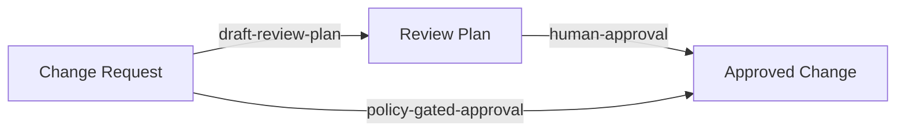

# Minimal Example Diagram

The diagram below names the composite approval path that the book reuses in later chapters.

The direct edge `policy-gated-approval` stands for the composition of `draft-review-plan` and `human-approval`.
This gives the reader one stable claim to revisit in later chapters.
