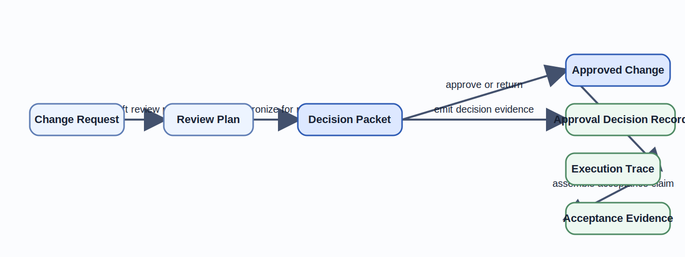

# Human and AI Responsibility Boundaries

An AI assistant can draft a reviewable plan in seconds, but that speed is useless if nobody can say where proposal ends and accountable approval begins.
This chapter defines the decision rights, artifacts, and control loops that keep AI-assisted work accountable.
It uses the [policy-gated change review](../../examples/common/policy-gated-change-review/README/) to show how a `Change Request` becomes a `Review Plan` and then an `Approved Change`.
The same artifact chain will anchor the formal chapters that follow.
It also distinguishes the decision outcome from the emitted evidence that later justifies acceptance and audit.

## Learning goals

- Distinguish responsibility boundaries from informal team custom or retrospective compliance work.
- Separate decision outcome artifacts from emitted evidence, execution trace, and later acceptance evidence.
- Identify where delegation, escalation, rollback, and review authority must remain explicit in an AI-assisted workflow.

## Prerequisites

- The framing in the [Introduction](../chapter-introduction/).
- Working knowledge of repository review, policy checks, and operational change control.

## Key concepts

- `responsibility boundary`
- `bounded delegation`
- `policy gate`
- `human review gate`

## Running example linkage

- The [problem statement](../../examples/common/policy-gated-change-review/spec/problem-statement/) and [acceptance criteria](../../examples/common/policy-gated-change-review/spec/acceptance-criteria/) are the canonical source behind the governed request that Figure 1.1 and Table 1.1 summarize locally.
- The [review checks](../../examples/common/policy-gated-change-review/verification/review-checks/), [execution trace](../../examples/common/policy-gated-change-review/implementation/execution-trace/), and [acceptance evidence](../../examples/common/policy-gated-change-review/verification/acceptance-evidence/) deepen the repository detail after the local exhibits have established the authority split.

## Why responsibility boundaries matter

This chapter treats responsibility boundaries as design structure, not compliance paperwork.
The boundary determines who may transform an artifact, what evidence must exist, and how the workflow responds when assumptions fail.

### Hidden delegation and diffused ownership

AI-assisted workflows often hide delegation inside prompts, tool wrappers, and merged automation.
In the running example, one maintainer may write the original `Change Request`, an AI agent may draft the `Review Plan`, a policy engine may reject unsafe scope, and a reviewer may authorize the next step.
If the repository records only the final diff, the team loses the boundary between proposal, evaluation, and approval.

Figure 1.1 makes that separation visible before the chapter turns to the supporting artifacts.

Figure 1.1. Responsibility boundaries separate decision artifacts from emitted evidence.
> **Reader takeaway.** A trustworthy workflow keeps the approval outcome distinct from the evidence that later explains or audits it.

Table 1.1. Canonical authority boundaries in the running example.

| Artifact or boundary | Primary authority | Why the distinction matters |
| --- | --- | --- |
| `Change Request` | Request owner | Defines scope and constraints before automation expands them. |
| `Review Plan` | Agent proposes, reviewer evaluates | Keeps delegated drafting separate from approval authority. |
| `Decision Packet` | Workflow synchronization boundary | Prevents policy and evidence from reaching review as unrelated fragments. |
| `Approved Change` | Human reviewer | Records the governed decision outcome. |
| `Approval decision record`, `execution trace`, `acceptance evidence` | Workflow emits evidence after approval or execution | Explains what happened without redefining who accepted risk. |

That loss creates three problems.
The first is decision ambiguity, because the team cannot tell who accepted which risk.
The second is verification ambiguity, because no artifact states what checks were supposed to run before implementation.
The third is operational ambiguity, because incident response starts without a clear chain from request to approval.

A responsibility boundary fixes those problems by making authority explicit before execution begins.
It names the actor, the allowable transformation, the required inputs, and the evidence that must exist after the step completes.
In practice, that means the boundary belongs in repository artifacts and workflow definitions, not only in team custom or oral memory.

### Auditability as a design objective

Auditability is often treated as something added after the workflow is already built.
That sequencing is too late for AI-assisted work.
If the design does not preserve the artifacts that explain why a change was allowed, no amount of logging can reconstruct the missing judgment.

The running example keeps auditability small and concrete.
A reviewer can inspect the [problem statement](../../examples/common/policy-gated-change-review/spec/problem-statement/), the [acceptance criteria](../../examples/common/policy-gated-change-review/spec/acceptance-criteria/), the proposed `Review Plan`, the named [verification checks](../../examples/common/policy-gated-change-review/verification/review-checks/), and the resulting `Approved Change`.
That set is already enough to ask whether the approved path preserved the intent of the request.

Auditability therefore becomes a design objective with clear consequences.
The workflow must preserve traceability across artifacts.
The review gate must be explicit.
The execution path must be reversible.
Those are architectural requirements, not administrative afterthoughts.

## Design artifacts as accountability surfaces

Responsibility boundaries become enforceable only when they are attached to durable artifacts.
Those artifacts make delegation reviewable because they preserve the intended scope and the evidence obligations across handoffs.

### Specifications, interfaces, and verification plans

A team cannot delegate safely from an unbounded request.
The `Change Request` must state the intended outcome, relevant constraints, and any non-goals that keep the scope small.
The [problem statement](../../examples/common/policy-gated-change-review/spec/problem-statement/) and [acceptance criteria](../../examples/common/policy-gated-change-review/spec/acceptance-criteria/) serve exactly that role in the running example.

They turn vague intent into a boundary that an agent can read without inventing hidden objectives.
The `Review Plan` is the next accountability surface.
It names the affected artifacts, the checks to run, the policy conditions that apply, and the questions that still require human judgment.

In other words, the plan is not a task list only.
It is an interface contract between the requesting context, the agent's proposal, and the reviewer's decision.
The [verification checks](../../examples/common/policy-gated-change-review/verification/review-checks/) then specify how the workflow will test its own claims.
They protect against a common failure mode in AI-assisted work, where a team delegates generation but forgets to delegate evidence.

### Decision logs and review records

Not every conversational detail needs to become a permanent artifact.
The durable record is the subset that explains why the boundary was crossed.
For the running example, that subset includes the approved request scope, the accepted review plan, the outcome of the policy gate, the human decision at the review checkpoint, and the trace that shows which implementation steps actually ran.

The running example uses four related records with different jobs.
`Approved Change` is the decision outcome artifact that marks the governed approval state.
An `approval decision record` is the emitted evidence entry that records who approved which `Decision Packet` and under which route.
An `audit log` is the broader durable record of actions and authority changes across the workflow.
`Acceptance evidence` is the final evidence bundle that ties specification, checks, the decision outcome, and the executed path into one acceptance claim.

An `audit log` and an `execution trace` are useful here because they record actions after the artifacts are defined.
They do not replace the artifacts themselves.
A trace can show that a tool call happened.
It cannot prove that the call was justified unless the `Change Request` and the `Review Plan` already stated the intended boundary.

This distinction is operationally important.
When an incident occurs, the team needs both the normative artifacts that state what should have happened and the traces that show what did happen.
Without both, postmortems degrade into guesswork.

## Allocating authority between humans and agents

A responsibility boundary is meaningful only if the workflow assigns different kinds of authority to different actors.
The point is not to minimize human involvement.
The point is to keep the human role concentrated where judgment, risk acceptance, and exception handling actually matter.

### Delegation, approval, and escalation

The book uses `bounded delegation` to describe work that an AI agent may perform without inheriting full decision rights.
In the running example, the agent may draft a `Review Plan`, suggest file-level changes, or summarize verification results.
The agent may not redefine the acceptance criteria, waive a failed `policy gate`, or approve the `Approved Change`.

Those actions change the risk posture of the repository and therefore remain human-led.
A good delegation rule names both the positive scope and the stop conditions.
The positive scope tells the agent what it may transform.
The stop conditions tell the workflow when to escalate.

Escalation should occur when the request touches an irreversible effect, when the policy outcome is ambiguous, when the proposed change conflicts with the stated acceptance criteria, or when the artifact set is incomplete.
These triggers are simpler than model-specific trust scoring.
They are tied to visible artifacts and visible invariants.

### Unsafe automation patterns

Several recurring patterns undermine responsibility boundaries even when teams believe they still have human oversight.
One unsafe pattern is letting the same automation both propose and approve the action.
Another is treating a prompt transcript as if it were a substitute for a specification.
A third is collapsing `policy gate` and `human review gate` into one vague "approved" status even though each step justifies a different claim.

A fourth is allowing implementation to start before the artifact set is complete, which converts review into retrospective cleanup.
A fifth is forgetting rollback and incident obligations once the change becomes operational.
These patterns are dangerous because they hide authority inside convenience.

The workflow appears fast, but the team can no longer explain why a risky step was permitted.
A trustworthy workflow keeps speed only where the boundary remains explicit.

## Operational control loops

Responsibility boundaries continue after approval because execution and operations can still falsify the design's assumptions.
The workflow therefore needs a control loop that carries evidence from runtime behavior back to the artifact set.

### Monitoring, rollback, and incident response

An `Approved Change` is not the end of responsibility.
It is the start of a higher-confidence execution path whose effects still need observation.
The workflow should therefore connect approval to monitoring conditions, rollback criteria, and incident routing.

If the implementation violates an expected invariant, the team needs an `execution trace` that identifies what ran and a `rollback` path that returns the system to a known safe state.
This requirement matters even for repository work.
A generated change can corrupt configuration, policy files, or automation scripts without failing immediately.

The responsibility boundary is credible only if the same design that allowed the change also makes reversal and diagnosis practical.
That is why later chapters treat `effect boundary` and orchestration as first-class concerns rather than operational footnotes.

### Feedback from operations to design

Operational feedback closes the loop from executed change back to the artifact set.
If a policy gate rejects too many safe changes, the problem may lie in the policy formulation, not in agent quality.
If a reviewer repeatedly escalates the same ambiguity, the `Change Request` template or `Review Plan` structure is probably underspecified.

If rollback occurs because a generated patch violated an unstated assumption, the missing invariant belongs in the specification and verification plan.
A mature workflow does not repair these issues with ad hoc prompt tuning alone.
It updates the governing artifacts so that the next composed path is clearer than the last one.

This is where compositional design becomes cumulative.
Each incident can refine the objects, transformations, and checks that later chapters will formalize.

## How this boundary model shapes the rest of the book

The boundary model in this chapter provides the engineering motivation for the book's formal vocabulary.
The later mathematical language is useful only because it sharpens the review questions already visible in this workflow.

### Questions to carry into the formal chapters

Once the reader sees responsibility boundaries as design structures, the later mathematical language has a concrete job to do.
Which artifacts are stable enough to treat as objects.
Which transformations preserve the meaning of a request well enough to treat them as morphisms.
When do two paths from request to approval claim the same result.

What structure must a translation preserve when moving from specification to architecture or from architecture to workflow.
How should effects be represented when tools, I/O, and rollback obligations enter the picture.
These are not abstract classroom questions.
They arise directly from the running example and from similar workflows in production engineering.

### Criteria for a trustworthy workflow

The rest of the book assumes a workflow is trustworthy only when a small set of criteria hold.
The artifact path from request to approval must be explicit.
The division between `policy gate` and `human review gate` must be visible.
Delegated agent work must remain bounded by stated scope and escalation rules.

Verification evidence must be tied to named claims rather than generic confidence.
Operational behavior must preserve traceability, rollback, and incident accountability.
When those criteria fail, later formal techniques will expose the failure more clearly, but they will not rescue an incoherent workflow by themselves.

When those criteria hold, the formal chapters become practical.
They help the reader reason about preserved meaning instead of merely describing process steps.
The next chapter starts that formal move by asking which artifacts and transformations are stable enough to model at all.

## Summary

- Responsibility boundaries become real only when decision rights, stop conditions, and evidence obligations are attached to durable artifacts.
- `Approved Change`, approval evidence, execution trace, and acceptance evidence play different roles and should not be collapsed into one vague approval story.
- Delegation remains trustworthy only when escalation, rollback, and operational feedback stay explicit across the workflow.

## Review prompts

1. Which artifact in your current workflow marks the decision outcome, and which artifact records the evidence that justified that decision.
2. Where does your current delivery path still blur the difference between policy evaluation and human approval.
3. Which operational feedback signal should update the governing artifact set rather than only a prompt or script.

## Notes and Further Reading

- Bass, Clements, and Kazman's *Software Architecture in Practice* is useful here because responsibility boundaries become maintainable only when the artifact views and decision interfaces stay explicit.
- NIST SSDF 1.1 and the SSDF community profile for generative AI are the closest operational counterparts to this chapter's approval, traceability, and evidence discipline.
- The term `responsibility boundary` is a reader-facing phrase in this book, so readers looking for adjacent governance language will often find the best external bridge in AI RMF rather than in category theory textbooks.
