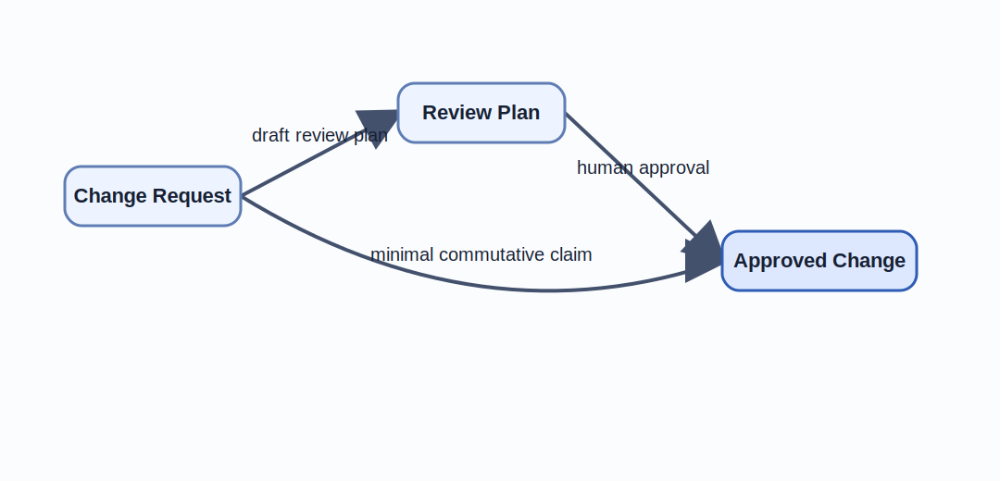
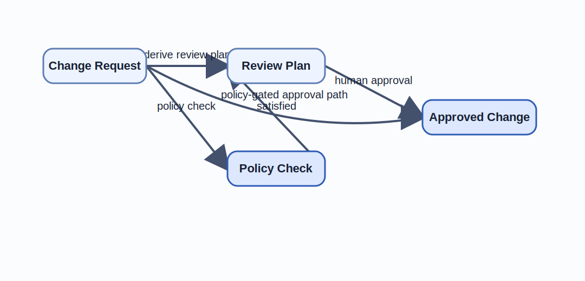

# Diagrams and Commutativity

Chapter 02 named the objects and morphisms of the workflow.
This chapter turns those names into a stronger question: do the visible paths preserve the same approval meaning, or do they only look compatible on paper.
It uses diagrams as compact proofs of consistency across multiple design views.
It begins with the minimal policy-gated approval diagram before expanding to the richer repository-level diagram used by the common running example.
The linked diagrams and matrix remain the canonical repository source, but Figure 3.1, Figure 3.2, and Table 3.1 carry the first-reading argument inside the chapter.

## Learning goals

- Read a diagram as a design argument about preserved meaning rather than as decoration.
- Use commutativity to test whether multiple workflow paths still justify the same claim.
- Connect diagram labels to repository artifacts, review questions, and verification consequences.

## Prerequisites

- The object, morphism, and composition vocabulary from [Chapter 02](../chapter-chapter02/).
- Familiarity with the running example artifact names `Change Request`, `Review Plan`, and `Approved Change`.

## Key concepts

- `commutative diagram`
- `traceability matrix`
- `coherence failure`
- `invariant`

## Running example linkage

- The [minimal diagram](../../examples/minimal/policy-gated-change-review/diagram/) is the canonical source behind Figure 3.1, and the [common commutative diagram](../../examples/common/policy-gated-change-review/design/commutative-diagram/) is the canonical source behind Figure 3.2.
- The [traceability matrix](../../examples/common/policy-gated-change-review/verification/traceability-matrix/) and [coherence failure artifact](../../examples/common/policy-gated-change-review/verification/coherence-failure/) become secondary inspection tools once the local figures and table have established the chapter's main claim.

## Why diagrams matter in engineering

This chapter treats a diagram as a compact design argument rather than an illustration.
The argument matters when a team needs to compare multiple paths, preserve one invariant, and decide whether the workflow is still trustworthy after a change.

### Diagrams as compact design arguments

Prose can describe a workflow step by step, but it often hides the relation between alternative paths.
A diagram makes those paths visible at once.
That visibility matters because the review question is usually not "What happens next?"
It is "Do these different routes preserve the same meaning?"

Figure 3.1 shows the smallest version of that question in the running example.

Figure 3.1. Minimal approval commutativity claim.
> **Reader takeaway.** The diagram matters only because the two visible paths are claiming one shared approval meaning.

The minimal diagram does not yet describe every operational detail.
It isolates one design claim that can be reviewed by hand.
If the composed path from `Change Request` through `Review Plan` to `Approved Change` is supposed to justify the direct edge `policy-gated-approval`, the diagram turns that statement into a visible proof obligation.

That is why diagrams are useful in engineering.
They compress a long explanation into a testable structure.
They also reveal missing nodes and edges quickly.
If the team cannot draw the intended transformation path without adding vague labels, the underlying design is usually underspecified.

### When prose is not enough

Prose fails first when the reader must compare several paths at once.
It also fails when the preserved invariant is easy to lose in paragraph form.
In the running example, the core invariant is that no change should reach the approved state unless the workflow preserves request meaning, policy constraints, and review intent across the path.

The richer repository diagram exposes this more clearly than a narrative paragraph.
It adds `Policy Check` as a separate node and shows that the direct approval claim is valid only when the request and the review plan remain aligned.
The result is not more abstraction for its own sake.
It is a tighter explanation of where the workflow may go wrong.

This is why the chapter starts with a minimal diagram and then expands to the richer repository view.
The minimal diagram teaches the reader how to read the claim.
The richer diagram shows why the same reading matters for actual repository artifacts, review checkpoints, and verification evidence.

## Commutative diagrams as consistency tests

Commutativity is useful here because it states a consistency claim across multiple paths.
If the claim fails, the diagram does not merely become less elegant.
It reveals a design defect.

### Equivalent paths and preserved meaning

A diagram commutes when different compatible paths preserve the same intended meaning.
In this book, that meaning is always tied to explicit artifacts and an explicit invariant.
The diagram does not commute because the arrows look symmetrical.
It commutes only if the workflow preserves what the design says should be preserved.

Figure 3.2 expands the same claim into the repository-level artifact path.

Figure 3.2. Repository-level approval claim with explicit policy dependency (`PGCR-01`).
> **Reader takeaway.** The direct approval edge is safe only if policy evaluation and human review preserve one invariant across named artifacts.

The [traceability matrix](../../examples/common/policy-gated-change-review/verification/traceability-matrix/) matters because it anchors this diagram to named repository artifacts.
That link prevents the diagram from drifting into a standalone picture with no verification consequence.

> **Review traceability.**
> Claim `PGCR-01` is the reader-visible anchor for Figure 3.2 in review discussion.
> Use the traceability matrix when the chapter needs the corresponding specification, verification, and implementation sources.

The practical reading is simple.
If one route from request to approved change loses a constraint or weakens the review meaning, the diagram does not commute for the invariant the team cares about.
The diagram has therefore become a consistency test, not a drawing convention.

### Broken squares as design defects

A broken square is an engineering defect because it means the design has claimed equivalence where none exists.
In the running example, the claim fails if the policy step silently narrows the request scope without updating the review plan.
It also fails if human approval is granted on a stale plan while the direct edge `policy-gated-approval` still implies a valid approval state.

Those failures are not merely documentation bugs.
They indicate semantic drift between artifacts.
The workflow may still run, but the path no longer preserves the meaning the repository claims it preserves.
That gap is exactly the kind of hidden inconsistency that later becomes a production incident, an audit problem, or a failed migration.

Counterexamples are therefore useful.
To test a diagram, ask which input, policy outcome, or approval context would make one path succeed while another should fail.
If such a case exists, the diagram either needs narrower scope, richer objects, or a new branch that represents the missing distinction explicitly.

## Cross-view consistency

The point of a diagram is not confined to one chapter-local argument.
It should connect specification, design, implementation, and verification views without forcing the reader to guess how the pieces line up.

### Requirements, architecture, and runtime views

The running example already provides the relevant views.
The [problem statement](../../examples/common/policy-gated-change-review/spec/problem-statement/) states the core constraint.
The [acceptance criteria](../../examples/common/policy-gated-change-review/spec/acceptance-criteria/) define what must be true for the example to count as complete.
The [design diagram](../../examples/common/policy-gated-change-review/design/commutative-diagram/) states the structural claim.
The [implementation workflow](../../examples/common/policy-gated-change-review/implementation/workflow/) shows how the claim is supposed to play out operationally.

Cross-view consistency means these artifacts preserve one coherent story.
The diagram should not imply a shortcut that the workflow never executes.
The workflow should not contain a gate that the specification never names.
The verification artifact should not check labels that the design never uses.

This is where diagrams become practical integration tools.
They allow one reviewer to compare requirement language with workflow structure without reading the entire repository as free-form prose.
They also prepare the reader for Chapter 04, where those cross-view mappings will be discussed more explicitly as structure-preserving translations.

### Mapping code-level artifacts back to design

Repository-level engineering still needs a path from diagram labels to concrete files and automated checks.
Without that mapping, a commutative claim is too vague to maintain.
The team needs to know which file, workflow step, policy definition, or test artifact corresponds to each node and edge that the diagram names.

The running example keeps this small on purpose.
The artifact map identifies the canonical files.
The review checks verify that the names remain aligned.
The traceability matrix shows where each core claim is represented across specification, design, verification, and implementation.

Table 3.1. Minimal artifact map for the repository-level diagram.

| Diagram label | Canonical artifact | Reader-facing question |
| --- | --- | --- |
| `Change Request` | `spec/problem-statement.md` and `spec/acceptance-criteria.md` | What request meaning is supposed to be preserved. |
| `Review Plan` | `design/artifact-map.md` and `review/reviewer-view.md` | What bounded plan the reviewer actually evaluates. |
| `Policy Check` | `runtime/runtime-view.md` and `implementation/workflow.md` | Which automated constraint shapes the approval path. |
| `Approved Change` | `implementation/workflow.md` and `verification/acceptance-evidence.md` | Which governed outcome the repository claims to authorize. |
| Claim `PGCR-01` | `verification/traceability-matrix.md` | Where specification, design, and verification still agree on one path claim. |

That combination allows a reviewer to move from `policy-gated approval path` in the diagram to the surrounding repository evidence without inventing an informal interpretation.
If a pull request changes one side of that mapping and not the other, the mismatch should be treated as a design regression.

## Diagram review techniques

Diagram review should be a disciplined activity with repeatable questions.
The goal is not aesthetic cleanliness.
The goal is to expose hidden assumptions before they reach implementation or operations.

### Minimal diagrams for design reviews

Start with the smallest diagram that expresses one invariant and one review question.
That is why this chapter begins with the minimal approval diagram rather than the richer repository view.
A reviewer can quickly ask whether `draft-review-plan` followed by `human-approval` really justifies `policy-gated-approval`.

Only after that reading is stable should the team introduce the richer diagram.
At that point the question becomes whether the policy dependency and artifact relationships still preserve the same claim under real repository constraints.
This staged approach reduces confusion and keeps the review conversation focused.

A useful minimal-review checklist is short.
- Does each node name a stable artifact or state?
- Does each arrow name a meaningful transformation rather than an implementation detail?
- Is the preserved invariant stated in adjacent prose?
- Is there at least one repository artifact that can verify the claim?

If the answer to any of these is no, the diagram is probably too vague for approval work.

### Counterexamples and edge cases

Every commutative claim should be challenged with at least one plausible failure path.
Ask what happens if the policy outcome is ambiguous.
Ask what happens if a reviewer sees a different version of the plan than the policy engine evaluated.
Ask what happens if an implementation step bypasses the named approval path entirely.

These are not adversarial exercises for their own sake.
They are ways to discover whether the diagram is missing a node, an arrow, a branch, or a scope restriction.
If a counterexample invalidates the claim, the team should update the diagram and the artifacts together rather than arguing that the edge case is too operational to matter.
The running example keeps one reusable [coherence failure artifact](../../examples/common/policy-gated-change-review/verification/coherence-failure/) so later chapters can cite the same broken claim without inventing a new negative example each time.

Edge cases are also useful for review sequencing.
The team can often decide whether a diagram is safe enough for a design review before any code exists.
That makes diagrams an early governance tool, not merely post hoc documentation.

## From diagrams to operational governance

Once diagrams become reviewable claims, they naturally support approvals, audits, and change control.
They give governance work a compact structure that can be cited, checked, and versioned alongside code and prose artifacts.

### Using diagrams in approvals and audits

An approval should not rely on a diagram alone.
It should rely on a diagram plus the artifacts that justify the claim.
In the running example, the reviewer can pair the diagram with the review checks and the traceability matrix to ask whether the approved path still matches the problem statement and acceptance criteria.

Audits benefit from the same structure.
Instead of asking only which steps ran, an auditor can ask which commutative claim the repository asserted and whether the recorded evidence supports it.
That is a stronger question because it checks preserved meaning, not merely event occurrence.

This is especially important in AI-assisted workflows.
Execution traces are necessary, but they are not enough.
The team also needs a stable diagram-level claim that explains why a given tool-mediated path was acceptable in the first place.

### Keeping diagrams synchronized with change

A diagram is useful only while it remains synchronized with the artifacts it summarizes.
If the workflow changes, the diagram, review checks, and traceability matrix should change in the same pull request.
If the problem statement changes, the preserved invariant in the diagram may need to change as well.

This discipline prevents a common failure mode in documentation-heavy teams.
The picture remains stable while the system drifts underneath it.
In a compositional workflow, that drift is dangerous because reviewers may trust a path equivalence claim that is no longer true.

The maintenance rule is straightforward.
Treat a diagram as a first-class design artifact.
Version it with the specification and verification evidence it depends on.
When the claim changes, update all three together.

## Summary

- Diagrams matter because they compress a workflow claim into a visible proof obligation.
- Commutativity is valuable only when paths preserve one named invariant across real repository artifacts.
- Broken squares are design defects because they reveal hidden semantic drift rather than harmless notation differences.

## Review prompts

1. Which diagram in your current system claims path equivalence without enough artifact evidence to justify it.
2. Which invariant would fail first if one branch silently changed scope, policy meaning, or approval context.
3. Which repository artifact should change in the same pull request when a commutative claim changes.

## Notes and Further Reading

- Fong and Spivak are the best next source if you want more examples of diagrams that carry operational meaning rather than decorative structure.
- Jackson's *Software Abstractions* is the strongest companion when this chapter makes you want a firmer counterexample discipline around design claims.
- NIST SSDF complements this chapter's diagram review heuristics by supplying a practical control vocabulary for synchronized, traceable change.
