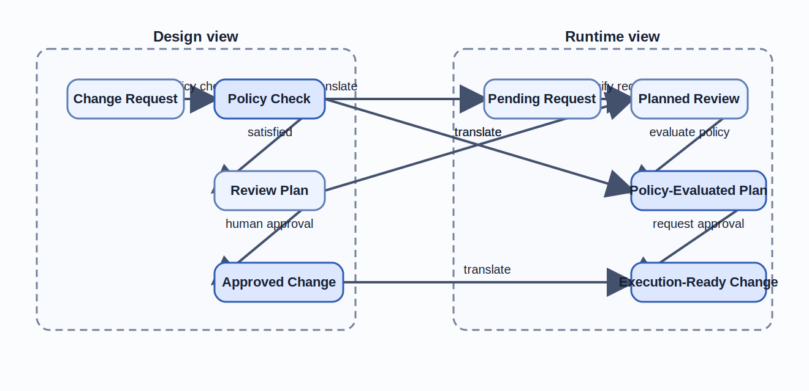

# Functors and Model Translation

Chapter 03 showed how a design can fail visibly when path equivalence is false.
Translation failure is more deceptive.
A system can look well documented all the way from specification to runtime while still losing the one approval meaning that made the workflow governable in the first place.

## Learning goals

- Identify which invariants must survive translation between specification, design, and runtime views.
- Read a functor as a structure-preserving translation rule rather than as loose naming similarity.
- Detect semantic drift and deliberate approximation in cross-view repository artifacts.

## Prerequisites

- The modeling vocabulary from [Chapter 02](../chapter-chapter02/).
- The diagram and commutativity review patterns from [Chapter 03](../chapter-chapter03/).

## Key concepts

- `functor`
- `runtime view`
- `semantic drift`
- `traceability matrix`

## Running example linkage

- The design, runtime, and implementation views are the canonical companion sources behind Table 4.1 and Figure 4.1.
- Use the [traceability matrix](../../examples/common/policy-gated-change-review/verification/traceability-matrix/) when you want file-level audit detail beyond the local chapter argument.
- The chapter also reuses deployment approval as a smaller transfer cue so the translation discipline is visible outside repository review before [Appendix D](../appendices/appendix-d/).

## Multiple abstraction levels in one system

One system usually needs more than one model because different readers ask different questions.
The mistake is not having several views.
The mistake is letting those views drift until they no longer describe the same system.

### Domain, architecture, and runtime categories

The running example already shows three useful abstraction levels.
The specification view describes what must always hold.
The design view describes how the artifact path and control points are organized.
The runtime view describes which execution-time states and transitions carry the same meaning during operation.

The views can be summarized as follows.

Table 4.1. Translation chain from specification to runtime.

| View | Representative objects | Representative morphisms | Main review question |
| --- | --- | --- | --- |
| Specification | `Change Request`, core constraint, acceptance criteria | `require-human-approval`, `require-traceability` | What must always remain true. |
| Design | `Change Request`, `Review Plan`, `Policy Check`, `Approved Change` | `derive review plan`, `policy check`, `human approval` | How is the constraint realized structurally. |
| Runtime | `Pending Request`, `Planned Review`, `Policy-Evaluated Plan`, `Execution-Ready Change` | `classify-request`, `evaluate-policy`, `request-human-approval` | What executes, and where is the evidence emitted. |

Figure 4.1 summarizes the smallest design-to-runtime translation chain used throughout this chapter.

Figure 4.1. Design-to-runtime translation keeps the approval path intact.
> **Reader takeaway.** Translation is acceptable only when execution detail changes without hiding policy evaluation or human approval.



The chapter treats each view as a category only to the extent that objects and morphisms can be mapped coherently.
This is not an invitation to remodel every operational detail.
It is a way to reason about whether one view still preserves the structure that another view cares about.

### What must remain invariant

Not every detail needs to survive translation.
The important question is which structural claims must survive.
In the running example, at least four invariants matter across views.

- Human approval remains mandatory before execution becomes ready.
- Policy evaluation remains distinct from human review.
- Request meaning and scope remain traceable across the path.
- Verification evidence remains linked to the same approval claim.

If a translation drops any of these, the problem is not merely editorial.
The design has changed.
That is why the chapter keeps returning to preserved invariants rather than to formatting similarity between documents.

## Functors as structure-preserving translations

Functors matter here because they impose discipline on translation.
They prevent a team from saying that two views "roughly match" when the structure they preserve is no longer clear.

### Objects and morphisms under translation

A functor maps objects to objects and morphisms to morphisms while preserving the relations the source model declares important.
In engineering terms, it is a translation rule that keeps the structure of the source view intelligible in the target view.

For the running example, a specification-level approval obligation maps to a design-level control path.
That design-level control path then maps to a runtime sequence in which policy evaluation and human approval both remain explicit.
The mapped objects are not textually identical, but they continue to play corresponding roles.

This is what keeps the translation useful.
If the specification says "no change reaches execution without human approval", the design view should not erase the human gate.
If the design view separates policy evaluation from human review, the runtime view should not collapse them into one opaque status transition.
When that collapse happens, the translation has stopped being structure preserving in the sense the chapter needs.

### Preserving composition across views

The stronger claim is not only that individual objects correspond.
It is that composed paths correspond as well.
If the design view says the policy-checked path reaches approval only after a satisfied policy result and human approval, the runtime view should preserve the same composed meaning in execution-time terms.

This is where functorial thinking becomes practical.
A translation that preserves objects but not composition is still misleading.
It tells the reader what the parts are called, but it loses how the parts work together.
For reviews and audits, that loss is often more dangerous than a mislabeled node.

**Formal bridge.**

```text
Let F map the design view to the runtime view.

F(Change Request) = Pending Request
F(Policy Check) = Policy-Evaluated Plan
F(Review Plan) = Planned Review
F(Approved Change) = Execution-Ready Change

F(human approval ◦ satisfied ◦ policy check)
  = request-human-approval ◦ evaluate-policy ◦ classify-request
```

The law says the runtime path may be more operationally explicit than the design path while still preserving the same approval meaning.
If one side removes human approval, collapses policy evaluation, or loses traceability, the translation stops behaving like the chapter's intended functor.

The traceability matrix provides lightweight evidence that composition has not been forgotten.
It does not prove full functorial correctness.
It does provide a repository-level check that the same claim appears across specification, design, verification, runtime, and implementation artifacts.

## Practical model translations

The concept becomes valuable only when the translations are concrete.
This section shows how the running example moves from specification to design and then from design to runtime and operations.

### From specification to architecture

The source obligations begin in the problem statement and acceptance criteria.
They say that human approval is mandatory and that the artifact path must remain traceable.
The design translation turns those obligations into named objects, control points, and edges.

That is why the design diagram includes both `Policy Check` and `Approved Change`.
Those nodes are not decorative.
They are the architecture-level realization of requirements that began in the specification view.
The artifact map then stabilizes where those design claims live in the repository.

A good specification-to-architecture translation does not preserve every sentence.
It preserves the constraints that must continue to hold after the system is decomposed.
If the architecture introduces a new shortcut that the specification never allowed, the translation is not faithful enough for governance work.

### From architecture to operational workflow

The next translation maps design structure into operational states and transitions.
The runtime-side model makes that mapping explicit.
`Change Request` becomes `Pending Request`.
`Review Plan` becomes `Planned Review`.
`Approved Change` becomes `Execution-Ready Change`.

This translation is useful because runtime systems rarely execute the same abstractions that architecture diagrams name directly.
They execute queues, state transitions, policy evaluations, and approval events.
The translation remains trustworthy only if those runtime constructs still preserve the design-level approval meaning.

The implementation workflow is therefore not the runtime model by itself.
It is the operational procedure that should align with the runtime view.
The runtime view carries the structure.
The workflow carries the sequence of work that realizes it.

**Transfer cue: deployment approval pipeline.**
The same translation burden appears in release governance.
A specification-level release obligation has to map to design-level release gates and then to runtime states such as `Pending Release`, `Policy-Evaluated Release Plan`, and `Execution Window`.
If one of those views hides human release approval inside an opaque automation status, the translation has lost the same approval meaning that the repository example is trying to preserve.

## Lossy mappings and risk boundaries

Not every translation can preserve every detail.
The danger lies in losing the wrong detail without noticing.
This section distinguishes uncontrolled semantic drift from deliberate approximation.

### Detecting semantic drift

Semantic drift occurs when the target view no longer preserves the meaning the source view intended.
In the running example, drift appears if the runtime view makes execution ready before the human approval event is explicit.
It also appears if the implementation workflow contains a bypass path that the design diagram never modeled.

The symptoms are concrete.
One artifact changes its labels while the others keep the old claim.
One view merges nodes that another view keeps separate for governance reasons.
One verification artifact can no longer explain which source requirement a runtime transition is satisfying.

These are translation defects, not mere documentation lag.
They should be reviewed with the same seriousness as interface regressions.
If the repository can no longer map one claim across views, the system has lost a piece of its design integrity.

### Documenting deliberate approximation

Approximation is not always wrong.
A runtime view does not need to reproduce every explanatory sentence from the specification.
An implementation workflow does not need to model every transient retry state that operations might log.
The key is to state what has been omitted and why the omission is safe.

A deliberate approximation should name its source view, the omitted detail, and the invariant that still holds.
For example, the runtime view in this repository does not model every logging event.
That omission is acceptable because the approval claim depends on control points and evidence obligations, not on every internal diagnostic record.

When approximation is documented, reviewers can evaluate the risk boundary explicitly.
When it is undocumented, the team can no longer tell whether the target view is simpler by design or simply missing critical structure.

## Heuristics for maintainable translations

Maintainable translations depend less on clever notation than on disciplined source choices and stable interfaces between views.
The heuristics in this section are intended to survive tool and workflow churn.

### Choosing stable source models

Start from the view that contains the most stable constraints.
In this repository, that usually means the problem statement, acceptance criteria, and the design diagram that realizes them.
Do not start from a prompt transcript, an implementation detail, or a temporary workflow optimization.

A stable source model is useful because later changes can be judged against it.
If the target view changes but the source constraints do not, reviewers have a fixed point for comparison.
That makes semantic drift easier to detect and deliberate approximation easier to justify.

The running example is intentionally small enough that the source model can be read end-to-end.
That size is a feature.
It lets the reader see how translation discipline works before the book moves to larger systems.

### Designing translation interfaces for change

Treat the handoff between views as an interface with stable labels, claim IDs, and artifact references.
That is why canonical terms, artifact paths, and claim links matter.
They reduce the cost of updating one view without losing the rest.

In practice, this means changing related artifacts together.
If the runtime view changes, the implementation workflow and traceability matrix should usually change in the same pull request.
If the design diagram changes, the specification claim it realizes should be rechecked at the same time.

This is the engineering payoff of functorial thinking.
It gives the team a concrete way to ask whether change preserved structure or only moved labels around.
Chapter 05 takes that same discipline into a harder situation: several views can all look legitimate while still disagreeing about one approval story.

## Summary

- Functorial translation matters because the move from specification to design to runtime is trustworthy only when it preserves human approval, the separation of policy evaluation from human review, traceability, and evidence linkage.
- A translation must preserve composed paths, not only label correspondences, if a reader is to trust that the runtime view still tells the same approval story as the design view.
- Semantic drift is acceptable only when the approximation is explicit about what was omitted, why it was omitted, and which invariants still survive the translation.

## Review prompts

1. Which invariant must remain explicit when your system translates `Change Request` into the next reviewable state in a runtime or implementation view.
2. Where does one of your views preserve labels but silently drop a step such as `Policy Check`, evidence linkage, or human approval.
3. Which translation in your workflow should force a coordinated update to the runtime view, implementation workflow, and traceability matrix before it can be trusted.

## Notes and Further Reading

- Riehl is the strongest next stop if you want the formal account of functors after this chapter's engineering translation of view-to-view preservation.
- Fong and Spivak are especially useful here because they connect structure-preserving translation to concrete systems rather than to notation alone, which is exactly the pressure this chapter puts on runtime views.
- Bass, Clements, and Kazman provide the most practical follow-up when you want to turn this chapter's preservation test into architecture-view discipline, approximation notes, and coordinated change control.
