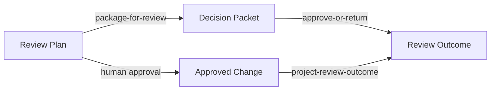

# Natural Transformations and View Changes

Chapter 04 argued that translation between views must preserve structure.
This chapter takes the next step by asking how several legitimate views can change without splintering the same approval story into incompatible narratives.
It explains how multiple views of one design can evolve without losing semantic coherence.
It uses the [design diagram](../../examples/common/policy-gated-change-review/design/commutative-diagram/), the [reviewer view](../../examples/common/policy-gated-change-review/review/reviewer-view/), and the [runtime view](../../examples/common/policy-gated-change-review/runtime/runtime-view/) to make natural transformations concrete.
Use the [traceability matrix](../../examples/common/policy-gated-change-review/verification/traceability-matrix/) to keep the same claim visible across views.

## Learning goals

- Distinguish multiple valid views of one design from semantically conflicting parallel stories.
- Read naturality as a review condition on whole paths, not only on object names.
- Evaluate whether a claimed refactor or adapter really preserves approval meaning across views.

## Prerequisites

- The translation discipline from [Chapter 04](../chapter-chapter04/).
- Familiarity with the [reviewer view](../../examples/common/policy-gated-change-review/review/reviewer-view/) and [runtime view](../../examples/common/policy-gated-change-review/runtime/runtime-view/).

## Key concepts

- `natural transformation`
- `naturality`
- `reviewer view`
- `version skew`

## Running example linkage

- Read the [reviewer view](../../examples/common/policy-gated-change-review/review/reviewer-view/) as the human-facing projection of the design claim.
- Compare it with the [runtime view](../../examples/common/policy-gated-change-review/runtime/runtime-view/) and the [coherence failure artifact](../../examples/common/policy-gated-change-review/verification/coherence-failure/) when testing whether one view change is still coherent.

## Why alternative views must cohere

Alternative views are useful because no single model serves every reader equally well.
They become dangerous when they drift apart while still claiming to describe the same system.

### Parallel models of the same system

The running example now has at least three relevant views of the same approval path.
The design view emphasizes artifact structure and control points.
The reviewer view emphasizes what a human decision-maker needs to see before approving or returning the change.
The runtime view emphasizes execution-time states and evidence obligations.

These views are not redundant.
They answer different questions for different actors.
The design view asks whether the approval structure is sound.
The reviewer view asks whether the decision packet is sufficient for judgment.
The runtime view asks whether the executed state transitions still preserve the same approval meaning.

The chapter's claim is that multiple views are acceptable only if they remain coherently aligned.
When one view changes shape, the others must still preserve the same design intent.
Otherwise the repository starts to contain parallel stories rather than parallel models.

### When disagreement between views matters

Not every difference between views is a problem.
Different labels, omitted detail, or reordered explanation can be harmless.
The disagreement matters when it changes what the workflow is claiming to preserve.

If the reviewer view merges policy status and human judgment into one opaque approval box, the view has hidden a distinction that the design and runtime views treat as structurally significant.
If the runtime view introduces an execution-ready state before the reviewer view would allow a positive decision, the views disagree about what counts as acceptable completion.
Those are not cosmetic differences.
They are semantic conflicts.

This is why Chapter 04's translation discipline is not enough on its own.
Chapter 04 asked whether structure was preserved when moving from one view to another.
Chapter 05 asks whether two parallel translations remain coherent across the whole model.

## Natural transformations as controlled change of view

Natural transformations matter because they compare whole views rather than isolated labels.
They express when one view-change behaves coherently across every relevant object and morphism in the source model.

### Components of a natural transformation

In engineering terms, a natural transformation begins with two functorial views over the same source model.
Here the source model is the design view centered on `Change Request`, `Review Plan`, `Policy Check`, and `Approved Change`.
One translation projects that design into a reviewer-facing decision packet.
Another translation projects the same design into runtime states and transitions.

The components of the natural transformation are the object-wise correspondences between those views.
For example, the design object `Review Plan` maps to `Decision Packet` in the reviewer view and to `Planned Review` in the runtime view.
The design object `Approved Change` maps to `Review Outcome` in the reviewer view and to `Execution-Ready Change` in the runtime view.

These correspondences are useful only if they preserve the same claim at the level of paths.
A component table without path coherence is just a glossary.
Natural transformation adds the stronger requirement that the whole view change behave consistently whenever the source model follows a morphism.

### Naturality as a consistency condition

Naturality is the condition that makes these view changes trustworthy.
If the source model follows a morphism and then changes view, the result should agree with changing view first and then following the corresponding morphism in the target view.
The order of those operations may differ, but the preserved meaning should not.

For the running example, consider the move from `Review Plan` toward approval.
The reviewer-facing square changes view by packaging a `Decision Packet` and then reaching `Review Outcome`.
The runtime view remains a second comparison point, but Figure 5.1 isolates the smallest reviewer-facing naturality claim.
The transformation is natural only if both views still preserve the same approval meaning and the same boundary between policy evaluation and human judgment.

This is the practical reading of naturality.
A view change is coherent when it does not silently alter what the workflow claims to mean.
The naturality check is therefore a design review rule, not only a formal definition.

Figure 5.1 shows the smallest reviewer-facing square that Chapter 05 expects to commute.

Figure 5.1. Reviewer-facing naturality square for one approval move.
> **Reader takeaway.** A new view is coherent only if packaging for review preserves the same approval meaning as the design path it summarizes.



**Formal bridge.**

```text
project-review-outcome ◦ human approval
  = approve-or-return ◦ package-for-review

where
package-for-review : Review Plan -> Decision Packet
project-review-outcome : Approved Change -> Review Outcome
```

The square says the reviewer-facing transformation must preserve the same approval meaning that the design view assigns to `human approval`.
If packaging a `Decision Packet` changes who may authorize the outcome or hides the policy distinction, the square no longer commutes in the engineering sense that this chapter needs.

Table 5.1. Practical tests for a natural reviewer-facing change.

| Review question | Healthy signal | Warning signal |
| --- | --- | --- |
| Does the new view preserve approval authority. | `approve-or-return` still expresses the same human checkpoint. | Approval appears to move into packaging or tool-mediated preprocessing. |
| Does the new view preserve policy meaning. | Route and policy labels remain recoverable from the packet. | Important policy distinctions disappear behind a simplified summary. |
| Does the new view preserve traceability. | Claim IDs and artifact references still map to the same design path. | The new view cannot be reconciled with the traceability matrix without extra explanation. |

## Refactoring without semantic drift

Many pull requests claim that a change is only a refactoring or only a new presentation layer.
Natural transformation gives the reviewer a stronger way to test that claim.

### Structural refactoring

A structural refactoring changes the organization of one view without changing the design meaning it is supposed to preserve.
For example, the reviewer view might reorganize the decision packet into separate sections for scope, policy status, and evidence links.
That change can still be natural if every design-level approval obligation remains visible and the mapped path still leads to the same reviewer-level outcome.

The same logic applies to runtime work.
A team may split one execution step into two internal states for scheduling or queueing reasons.
That split can still preserve the design claim if the runtime view continues to respect the same approval boundary and the same evidence obligations.

Refactoring therefore becomes a path-preservation question.
The reviewer should ask not only whether the code still works, but whether the changed view is still naturally aligned with the source model and the other views that depend on it.

### Behavioral equivalence claims

Behavioral equivalence claims are stronger than structural cleanup claims.
They say that the system is not only reorganized, but also observably the same with respect to the relevant invariants.
In the running example, a claim of equivalence would need to preserve at least the mandatory human gate, the distinct policy step, and the traceable path to the approved state.

This is where semantic drift often hides.
A team may simplify the reviewer packet, rename runtime states, or collapse two UI steps into one form and then describe the result as behaviorally identical.
If one of those changes weakens the evidence visible to the reviewer or the boundary visible to operations, the equivalence claim is too strong.

Natural transformation helps because it requires coherence across the mapped paths.
If one path no longer commutes under the claimed view change, the equivalence argument should be rejected or narrowed.

## Interface adaptation and compatibility layers

Real systems often need adapters and facades because views evolve at different speeds.
Those mechanisms are useful only when they preserve the same underlying claim rather than disguising divergence.

### Adapters, facades, and canonical forms

An adapter reshapes one interface into another compatible one.
A facade hides internal complexity behind a simpler external boundary.
Both can support coherent view changes when they are anchored to a stable source model.

In the running example, the reviewer view acts partly like a facade.
It hides execution-time detail and exposes only the information needed for judgment.
The runtime view acts more like an adapter target.
It names operational states and transitions that the reviewer does not need to see directly.

Neither pattern is safe by default.
The reviewer-facing facade must still preserve the approval meaning carried by the design view.
The runtime-oriented adapter must still preserve the same control-point separation.
If either one drops that structure, the repository gains compatibility theater instead of compatibility.

### Managing version skew across views

Version skew occurs when one view is updated and the others lag behind.
In repositories with multiple design artifacts, this is common and dangerous.
The design diagram may reflect a new approval path while the reviewer view still describes the old packet structure.
The runtime view may add a state that no reviewer artifact mentions.

A small amount of temporary skew may be unavoidable during a change set.
The key is to prevent it from crossing review boundaries unresolved.
The safest rule is to update related views in the same pull request and use the traceability matrix to check whether the same claim still appears across them.

If the skew is intentional, the repository should state the migration boundary explicitly.
If it is accidental, the change should be treated as incomplete.
This is another place where naturality becomes an operational review heuristic rather than a purely formal idea.

## Review heuristics for view changes

View-change reviews should demand evidence proportional to the coherence claim being made.
If a pull request says "presentation only" or "equivalent refactor", the repository should show why that statement is true across the relevant views.

### Evidence expected in a pull request

For the running example, a credible pull request should show at least the following.

- Which source view is being changed and which dependent views are affected.
- Which invariant or claim ID is expected to remain stable.
- Whether the reviewer view, runtime view, and design view were all checked for coherence.
- Which artifacts were updated together, including diagrams, matrices, and workflow files.
- Why any omitted update is safe within the stated migration boundary.

This evidence can be concise.
It does not need a proof appendix for every rename.
It does need enough structure that another engineer can reconstruct the naturality claim and challenge it if necessary.

The chapter's point is practical.
A repository should not trust view-change claims that are impossible to review after the fact.

### Signals that a transformation is not natural

Several signals suggest that a transformation is not natural in the engineering sense this book uses.
One view merges two distinctions that another view still treats as essential.
One mapped path no longer preserves the same approval meaning.
One artifact changes labels or state names without updating the related evidence path.

Another signal is asymmetric simplification.
The reviewer view becomes simpler, but only by hiding information that the runtime and design views still require for governance.
A final signal is unexplained version skew across linked artifacts.
If the traceability matrix and the changed view can no longer point back to the same claim, the transformation is probably not coherent enough to approve.
The running example keeps one reusable [coherence failure artifact](../../examples/common/policy-gated-change-review/verification/coherence-failure/) so later chapters can cite the same broken claim instead of inventing a new one.

These signals are intentionally concrete.
They allow reviewers to reject vague equivalence claims without requiring advanced mathematics in the review thread.
That sets up Chapter 06, where the book moves from coherent view change to selecting the simplest correct construction for combination and variation.

## Summary

- Multiple views are useful only while they preserve one coherent design claim across corresponding paths.
- Naturality turns a view-change claim into a concrete review question about preserved meaning.
- Adapters, facades, and refactors are acceptable only when version skew and evidence drift remain controlled.

## Review prompts

1. Which view in your current system most often claims to be equivalent while hiding a different approval meaning.
2. Which path in your repository would you use as the naturality test for a claimed presentation-only change.
3. Where should a traceability update occur if a reviewer-facing facade changes but the runtime path is supposed to stay equivalent.

## Notes and Further Reading

- Awodey and Riehl supply the formal account of natural transformations, but this chapter intentionally recasts that account as a repository review question.
- Evans's *Domain-Driven Design* is a useful practical companion because many failed view changes collapse first at the level of language discipline and boundary meaning.
- The terms `reviewer view` and `runtime view` are engineering-facing labels rather than standard textbook phrasing, so Appendix C remains the main bridge back to the formal literature.
