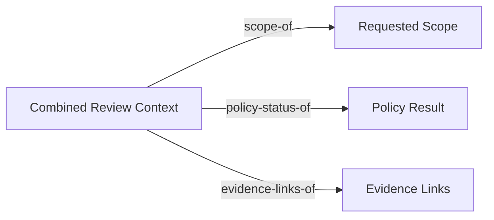
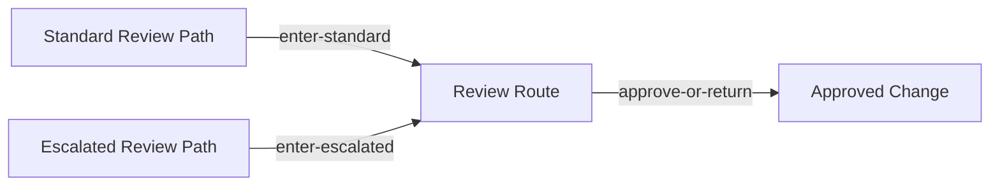

# Universality with Products and Coproducts

This chapter uses universal properties to choose simple, correct constructions for combination and variation.
It uses the [variation paths](../../examples/common/policy-gated-change-review/design/variation-paths/), the [reviewer view](../../examples/common/policy-gated-change-review/review/reviewer-view/), and the [implementation workflow](../../examples/common/policy-gated-change-review/implementation/workflow/) to keep products and coproducts tied to repository artifacts.
Use the [traceability matrix](../../examples/common/policy-gated-change-review/verification/traceability-matrix/) to check that new combinations and new routes still preserve the same approval claim.

## Learning goals

- Recognize when a workflow needs one canonical combined context instead of loosely synchronized fields.
- Recognize when route variation deserves an explicit shared boundary instead of hidden flags.
- Use universal-property reasoning to select the smallest reusable construction that still preserves approval meaning.

## Prerequisites

- The coherence rules for multiple views from [Chapter 05](../chapter-chapter05/).
- Familiarity with the [variation paths](../../examples/common/policy-gated-change-review/design/variation-paths/) artifact.

## Key concepts

- `universal property`
- `product`
- `coproduct`
- `Combined Review Context`

## Running example linkage

- Read the [variation paths](../../examples/common/policy-gated-change-review/design/variation-paths/) artifact before comparing `Combined Review Context` and `Review Route`.
- Keep the [reviewer view](../../examples/common/policy-gated-change-review/review/reviewer-view/) and [implementation workflow](../../examples/common/policy-gated-change-review/implementation/workflow/) nearby when deciding whether the construction really supports reuse.

## Universal properties as design criteria

Universal properties matter when several designs look plausible but only one gives the cleanest reusable boundary.
They help a team choose a canonical combination or a canonical variation point instead of accumulating ad hoc cases.

### Why universality beats ad hoc pattern matching

Software teams often pick structures because they resemble a familiar pattern.
That is weaker than asking what problem the structure solves and why it is the simplest correct answer.

In the running example, there are many ways to package review information.
One team might pass the raw change request, the policy result, and evidence links as three separate inputs.
Another team might create one oversized review object with unrelated metadata attached.
Both approaches can work locally, but neither tells the reviewer whether the chosen object is the right shared boundary for the workflow.

Universality asks a stronger question.
What is the smallest construction that preserves every component the approval step must recover.
For Chapter 06, that question leads to a product-like `Combined Review Context`.
The same discipline applies to variation.
Instead of sprinkling boolean flags and special cases through the workflow, the repository can make route alternatives explicit through a coproduct-like `Review Route`.

This is why universality beats pattern matching.
It does not ask whether the shape looks familiar.
It asks whether other equally valid candidates can reduce through the chosen construction without inventing new semantics.

### Reading the universal condition in engineering terms

The universal condition sounds abstract until it is translated into review language.
In engineering terms, it says that the chosen construction should be the canonical place where a repeated design obligation is assembled or consumed.

For a product, the obligation is combination.
If another tool or artifact claims to carry the same review-ready information, it should map cleanly to the same `Combined Review Context` and expose the same recoverable components.
If it cannot, the repository probably has more than one implicit approval boundary.

For a coproduct, the obligation is explicit variation.
If a new review route is introduced, it should enter the same `Review Route` boundary through a named path rather than forcing every downstream consumer to learn another hidden branch rule.
If it cannot, the repository probably does not have a stable shared interface for route-specific behavior.

This is the practical meaning of universality in this book.
The design is not chosen because it is mathematically elegant in isolation.
It is chosen because it minimizes accidental branching and makes review consequences explicit.

## Products for combined requirements

Products help when several requirements must be available together at one boundary.
They are especially useful when a review or execution step becomes unsafe if one component is missing, stale, or implicit.

### Joint constraints and shared context

The running example needs several facts at the same time before a human can approve a change.
The reviewer must see the requested scope.
The reviewer must see the current policy result.
The reviewer must see links to the evidence that justifies the claim.

The new [variation paths](../../examples/common/policy-gated-change-review/design/variation-paths/) artifact captures that combination as `Combined Review Context`.
This object is product-like because it treats those three inputs as jointly required and supports canonical projections back to each one.
The reviewer-facing `Decision Packet` from Chapter 05 is the presentation of this combined context, not a separate source of truth.

The combined requirements can be summarized as follows.

| Component | Why approval depends on it |
| --- | --- |
| `Requested Scope` | The reviewer must judge what the change intends to alter. |
| `Policy Result` | The reviewer must know which automated constraints have already been checked. |
| `Evidence Links` | The reviewer must be able to inspect the supporting diff, logs, or proofs. |

Figure 6.1 shows the product-like boundary that makes the approval packet recoverable instead of opaque.

Figure 6.1. Product-like review context keeps all three approval inputs recoverable.
The packet remains canonical only when scope, policy, and evidence can be projected back out.



**Formal bridge.**

```text
Product sketch:
π_scope : Combined Review Context -> Requested Scope
π_policy : Combined Review Context -> Policy Result
π_evidence : Combined Review Context -> Evidence Links

For any X with
s : X -> Requested Scope,
p : X -> Policy Result,
e : X -> Evidence Links,
there exists a unique ⟨s, p, e⟩ : X -> Combined Review Context.
```

This sketch makes the product claim visible.
Any richer review packet is acceptable only if it still reduces to the same canonical context without inventing another approval boundary.

This matters because approval is not a property of any one component alone.
Scope without policy status is incomplete.
Policy status without evidence is hard to trust.
Evidence without scope leaves the reviewer unable to judge relevance.
The product-like boundary makes that dependency explicit.

It also prevents accidental growth.
If a team keeps adding unrelated preferences, cached hints, or temporary diagnostics to the approval packet, the canonical product becomes harder to review.
The right product is not the largest bundle.
It is the smallest bundle that still makes every required component recoverable.

### Multi-input interfaces and synchronized state

Product-like design also clarifies multi-input interfaces.
The policy engine, the reviewer, and the implementation workflow all depend on aligned information about the same change.
If those inputs are passed separately and refreshed at different times, the workflow can combine inconsistent facts without noticing.

In the running example, a `Policy Result` must refer to the same `Requested Scope` that the reviewer sees.
The `Evidence Links` must point to the same artifact set that the policy check evaluated.
If those references drift, the system may still look complete while the approval meaning is no longer stable.

The product-like `Combined Review Context` gives the repository one place to inspect that synchronization.
The workflow can project the scope, policy status, and evidence links separately.
It can also ask whether they still belong to the same review event.
That is a stronger guarantee than passing three fields through ambient state and hoping they stay aligned.

This is why products matter in software design.
They turn joint requirements into an explicit interface.
That interface can then be reviewed, versioned, and reused across artifacts instead of being rebuilt informally in each tool or script.

## Coproducts for alternatives and variation

Coproducts help when a workflow has genuine alternatives that should remain explicit.
They are useful only when the alternatives share a real downstream boundary rather than merely resembling one another.

### Variant handling and explicit branching

The running example now makes route variation explicit through the same [variation paths](../../examples/common/policy-gated-change-review/design/variation-paths/) artifact.
It distinguishes `Standard Review Path` from `Escalated Review Path`.
Both are legitimate routes to approval.
Neither is allowed to invent its own terminal artifact.

This is the coproduct-like reading.
Each variant enters the common `Review Route` boundary through a named entry.
The downstream workflow can then consume `Review Route` as one shared interface while preserving the fact that the route came from a specific variant.

The route split is concrete rather than stylistic.

| Variant | Trigger | Shared guarantee |
| --- | --- | --- |
| `Standard Review Path` | Default repository scope and satisfied policy status without exceptions | Human approval remains mandatory before `Approved Change`. |
| `Escalated Review Path` | Protected files, elevated operational risk, or policy exceptions | Human approval remains mandatory before `Approved Change`. |

Figure 6.2 makes the route split explicit before the chapter returns to the formal coproduct sketch.

Figure 6.2. Explicit review routes converge on one approval meaning.
Route variation stays visible at the boundary without creating a second approval artifact.



**Formal bridge.**

```text
Coproduct sketch:
ι_standard : Standard Review Path -> Review Route
ι_escalated : Escalated Review Path -> Review Route
```

The injections make route origin explicit while preserving one downstream review boundary.
The workflow may branch on route-specific obligations, but it should not create a second canonical approval meaning after route selection.

This is better than hiding the distinction inside free-form comments or a boolean flag.
An opaque flag says that some difference exists.
It does not say where the common boundary begins or which consumers may rely on the shared semantics after branching.

The coproduct-like design also keeps the book's running example disciplined.
The repository still has one canonical `Approved Change`.
Variation happens in the route toward that artifact, not in the meaning of approval itself.

### Stable extension points

Stable extension points matter because workflows rarely stop with two variants forever.
A later chapter may need to add a security review route, a migration route, or a temporary compatibility route.
If the current design forces every downstream consumer to inspect every variant directly, extension cost grows linearly with every new case.

A coproduct-like `Review Route` avoids that trap.
Variant-specific preparation stays near the entry point.
Downstream consumers can rely on the shared boundary and focus on what remains common after route selection.
That is the engineering value of the universal condition.
It concentrates branch-specific logic before the common workflow resumes.

The repository should still be skeptical about creating new variants.
If two paths differ only in UI wording or team ownership, a new coproduct branch may be premature.
A branch becomes justified when it carries distinct obligations, evidence requirements, or risk handling that later consumers must respect.

This is also what keeps extension points stable.
The route boundary should stay small and explicit.
If adding one new branch requires rewriting the reviewer view, runtime view, and implementation workflow from scratch, the supposed coproduct boundary was never actually shared.

## Composition patterns built from universality

Universal constructions matter because they can be reused once the boundary is correct.
They turn one local modeling decision into a repository-wide simplification.

### Decompose once and reuse many times

The `Combined Review Context` and `Review Route` are useful beyond Chapter 06.
They give the repository stable handles for later chapters and for future pull requests.
The reviewer view can render the combined context.
The implementation workflow can route work through the explicit review variants.
The traceability matrix can continue pointing to one approval claim even while route variation grows.

This is the practical payoff of decomposition.
The team defines the structure once.
Later artifacts can reuse the same decomposition instead of inventing parallel names for the same boundary.
That lowers coordination cost and makes review threads easier to follow.

Reuse also improves verification.
If one artifact changes the route structure or the combined context, the related files become obvious.
The team knows where to look because the universal construction has a named home in the repository.
That is much harder when the same distinction is encoded informally in multiple scripts, prompts, and comments.

### Avoiding premature specialization

Universal constructions are not a license to formalize every possible distinction.
They are a way to choose the simplest correct structure for the obligations that already exist.
Premature specialization happens when a team creates a product for information that is never jointly required or a coproduct for variants that are not semantically distinct.

In the running example, it would be premature to define separate review routes for every reviewer preference or tooling detail.
Those differences may matter operationally, but they do not necessarily change the approval meaning.
Likewise, it would be premature to create a heavier combined context if only one consumer actually needs the extra data.

This is where universality protects maintainability.
It rewards the smallest structure that supports real reuse.
It discourages freezing transient distinctions into canonical interfaces.
That discipline is particularly important in AI-assisted systems, where tool behavior and prompt structure can change faster than the governance boundary should.

## Selecting the simplest correct construction

The final step is operational.
Before naming a product or coproduct in a design review, the team should ask whether the candidate construction really earns that role.

### Questions for product-like designs

- Which components must always be available together at one review or execution boundary.
- Can each required component be recovered from the combined object without hidden global lookups or ambient state.
- If another tool builds a richer context, can that context reduce cleanly to the same canonical combined object.
- Would removing one component weaken the approval meaning, the evidence path, or the verification claim.

### Questions for coproduct-like designs

- Are the variants different in obligations, risk handling, or evidence requirements rather than only in presentation.
- Can each variant enter a named shared boundary without changing the downstream meaning of approval.
- Do all variants still converge on the same canonical artifact and the same invariants after route selection.
- Would adding one more variant preserve the shared consumer interface, or would it force every downstream artifact to branch again.

If these questions do not have clear answers, the repository is probably not ready to claim a universal construction.
The design may still work.
It is simply not yet structured enough to support the stronger reuse and review guarantees that products and coproducts promise.

That conclusion sets up Chapter 07.
Once combination and variation are explicit inside one workflow, the next step is to connect workflows across shared boundaries and controlled replacement paths.

## Summary

- Product-like structures are useful when several components must be present together at one decision boundary.
- Coproduct-like structures are useful when genuine alternatives need one explicit shared consumer boundary.
- Universality rewards the smallest construction that supports reuse and rejects ad hoc branching that hides review consequences.

## Review prompts

1. Which review packet in your current workflow is pretending to be one object while actually hiding three unrelated inputs.
2. Which route variation in your system deserves a named coproduct-style boundary rather than a boolean flag.
3. Which extra field in your review context is operationally convenient but not part of the smallest correct universal construction.
