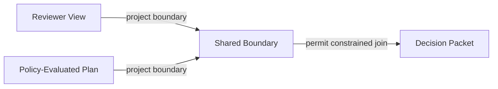
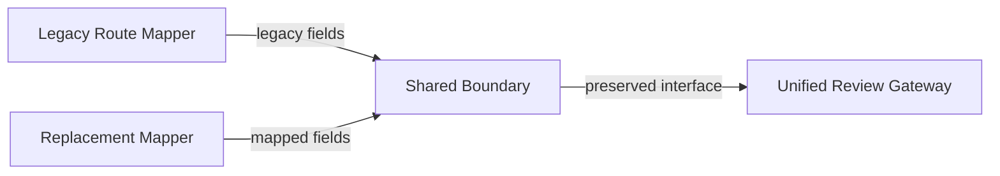

# Pullbacks and Pushouts for Integration and Migration

Chapter 06 made combination and variation explicit inside one governed workflow.
This chapter moves to the harder problem of joining workflows across a shared boundary and replacing one subsystem with another without losing route semantics, provenance, or approval meaning.
It applies categorical integration patterns to system joins, migrations, and controlled replacement.
It uses the [shared boundary](../../examples/common/policy-gated-change-review/design/shared-boundary/), the [replacement plan](../../examples/common/policy-gated-change-review/design/replacement-plan/), and the [coherence failure artifact](../../examples/common/policy-gated-change-review/verification/coherence-failure/) to keep the formal vocabulary tied to repository artifacts.
Use the [variation paths](../../examples/common/policy-gated-change-review/design/variation-paths/) and the [traceability matrix](../../examples/common/policy-gated-change-review/verification/traceability-matrix/) alongside this chapter.

## Learning goals

- Identify the shared boundary that must stay stable before integration or migration can be trusted.
- Read pullbacks as constrained joins and pushouts as controlled replacements along one preserved boundary.
- Decide when a mismatch requires redesign instead of a broader mapping layer.

## Prerequisites

- The product and coproduct discipline from [Chapter 06](../chapter-chapter06/).
- Familiarity with the [shared boundary](../../examples/common/policy-gated-change-review/design/shared-boundary/) and [replacement plan](../../examples/common/policy-gated-change-review/design/replacement-plan/) artifacts.

## Key concepts

- `pullback`
- `pushout`
- `shared boundary`
- `Approval Route ID`

## Running example linkage

- Read the [shared boundary](../../examples/common/policy-gated-change-review/design/shared-boundary/) before interpreting any integration or migration claim in this chapter.
- Keep the [replacement plan](../../examples/common/policy-gated-change-review/design/replacement-plan/) and [coherence failure artifact](../../examples/common/policy-gated-change-review/verification/coherence-failure/) open when evaluating whether a join or replacement really preserves approval meaning.

## Shared boundaries in integration work

Integration begins by naming the boundary that multiple systems are supposed to share.
If that boundary is vague, every later join or migration becomes a negotiation instead of a checkable design step.

### Canonical keys, schemas, and policies

The running example now makes this boundary explicit in [design/shared-boundary.md](../../examples/common/policy-gated-change-review/design/shared-boundary/).
The point is not to centralize every field in the repository.
The point is to stabilize the smallest set of labels that reviewer, runtime, verification, and migration artifacts must agree on before they can be composed safely.

The shared boundary can be summarized as follows.

Table 7.1. Canonical shared-boundary elements.

| Boundary element | Why it matters |
| --- | --- |
| `Change Identity` | Keeps every joined artifact attached to the same proposed change. |
| `Repository Scope` | Prevents a join from combining evidence for different affected areas. |
| `Policy Classification` | Preserves the meaning of satisfied, exception-required, and rejected outcomes. |
| `Approval Route ID` | Keeps route-sensitive logic aligned with `Standard Review Path` and `Escalated Review Path`. |

These are design commitments, not merely data fields.
If one artifact drops `Approval Route ID`, the repository can no longer tell whether reviewer evidence and runtime evidence describe the same path.
If one artifact renames `Policy Classification` without an explicit schema mapping, the integration boundary has already started to drift.

This is why Chapter 07 starts with boundary objects rather than with joins.
Pullbacks and pushouts are only as trustworthy as the shared boundary they preserve.

### Why integration fails at the boundary

Integration usually fails before any merge algorithm runs.
It fails when two systems claim to talk about the same change while using different identifiers, route labels, or policy vocabularies.
At that point the apparent join is only a coincidence of partial overlap.

The running example's [coherence failure artifact](../../examples/common/policy-gated-change-review/verification/coherence-failure/) shows the cost of ignoring this.
The route still appears to converge on `Approved Change`, but the reviewer-facing packet has already lost the policy distinction that the runtime view preserves.
That is not an integration success with incomplete documentation.
It is a broken shared boundary.

This is the practical reason to formalize canonical keys and policies.
They turn a vague question such as "Can these artifacts be combined" into a concrete question about whether the claimed boundary is still preserved.
Without that discipline, pullbacks become informal joins and pushouts become blind replacements.

## Pullbacks for constrained joins

Pullbacks matter when two structures may be joined only under a shared constraint.
In repository work, that usually means the join is valid only when identity, scope, and policy semantics already agree.

### Joining systems under shared conditions

The engineering reading of a pullback is a constrained join.
The join succeeds only where the participating artifacts agree on the shared boundary.
For the running example, the reviewer-facing `Decision Packet` and the runtime-side `Policy-Evaluated Plan` should be joined only where they point to the same `Change Identity`, the same `Repository Scope`, and the same `Approval Route ID`.

This is stricter than an ordinary database join.
Matching one identifier is not enough if route labels or policy meanings differ.
The pullback discipline says that the repository should refuse the join instead of hiding the mismatch behind one coerced record.

The [shared boundary artifact](../../examples/common/policy-gated-change-review/design/shared-boundary/) therefore acts as the contract for valid joins.
It lets the team state clearly which reviewer evidence, runtime evidence, and verification evidence may be treated as one integrated context.
If one side violates that contract, the right response is to narrow the join or redesign the boundary.

Figure 7.1 shows the constrained join that the shared boundary is supposed to permit.

Figure 7.1. Constrained joins remain valid only through one preserved shared boundary.
> **Reader takeaway.** Integration is governed only when every joining branch projects the same route, scope, and policy meaning onto one shared boundary.



**Formal bridge.**

```text
Pullback sketch:

Decision Packet --------> Reviewer View
      |                        |
      v                        v
Policy-Evaluated Plan -> Shared Boundary
```

The join is valid only where both lower paths preserve `Change Identity`, `Repository Scope`, `Policy Classification`, and `Approval Route ID`.
If one of those boundary elements drifts, the repository no longer has the constrained join that justified treating the records as one governed packet.

That matters operationally.
A reviewer who sees one route while the runtime logs another is not looking at a minor inconsistency.
The repository has lost the constrained join that justified treating those records as one governed approval path.

### Provenance and policy preservation

Pullbacks are useful only if the joined structure keeps the origin of its parts visible.
In Chapter 07, provenance means knowing which policy evaluation, which route selection, and which source artifact contributed to the joined view.
Without that record, the join may still exist, but it will be hard to trust or audit.

The running example keeps provenance lightweight rather than elaborate.
The traceability matrix already tells the reader where core claims are represented.
The shared boundary tells the reader which keys and route labels must match before those claims may be treated as one integrated record.
Together they provide a repository-level answer to a common review question: which policy result and which approval route produced this supposedly integrated state.

This also explains why policy preservation matters.
If one system uses `exception-required` while another reduces that outcome to a generic pass, the pullback has not preserved the same policy meaning.
The join should be rejected or mediated by an explicit schema mapping.
That is safer than pretending that provenance can compensate for a lost constraint.

## Pushouts for merger and migration

Pushouts matter when a team wants to replace or merge components along a shared boundary.
In software work, that means the replacement should happen through an interface the old and new structures can both honor.

### Replacing components without losing meaning

The running example models this with [design/replacement-plan.md](../../examples/common/policy-gated-change-review/design/replacement-plan/).
The plan replaces a `Legacy Route Mapper` with a `Unified Review Gateway`.
The migration is safe only if both sides preserve the same shared review boundary while the cutover happens.

That is the engineering reading of a pushout in this chapter.
The team is not merely deleting one component and inserting another.
It is merging the old and new structures along a shared interface so downstream artifacts can continue to consume the same approval meaning.

The shared interface is small on purpose.
It carries `Change Identity`, `Repository Scope`, `Policy Classification`, and `Approval Route ID`.
If the new gateway changes any of those without an explicit mapping, the replacement has already stepped outside the pushout discipline.
The result might still compile.
It would no longer preserve the boundary that made the migration governable.

Figure 7.2 makes the replacement path visible before the chapter turns back to the pushout sketch.

Figure 7.2. Controlled replacement stays anchored to one shared boundary.
> **Reader takeaway.** Replacement is safe only when legacy and new outputs stay comparable on one preserved boundary during migration.



**Formal bridge.**

```text
Pushout sketch:

Legacy Route Mapper ----> Unified Review Gateway
        |                          ^
        v                          |
   Shared Boundary <---- Replacement Mapper
```

The pushout claim is that both old and replacement components meet at one shared interface before downstream artifacts consume the new gateway.
If the cutover changes the shared boundary itself, the migration is no longer a controlled replacement of the same approval path.

This is why blind cutovers are dangerous in AI-assisted systems.
Tooling can be replaced quickly, but approval meaning changes more slowly.
Pushout-style thinking forces the team to ask which boundary is being preserved before it celebrates a successful swap.

### Controlled schema and interface migration

Real migrations often fail through schema drift before behavior is obviously wrong.
The replacement plan therefore includes an explicit schema mapping from legacy field names to the shared boundary.
That mapping is not a clerical detail.
It is the evidence that old and new structures can be compared on one contract.

In the running example, `legacy_policy_status` becomes `Policy Classification`.
`legacy_route_hint` becomes `Approval Route ID`.
Those renamings are safe only if they preserve the same route semantics and the same review obligations.
If a field is dropped or collapsed during the migration, the pushout should be treated as invalid or incomplete.

Controlled migration therefore has a staged shape.
Run both components in shadow mode.
Compare the outputs at the shared boundary.
Cut over only when the old and new structures preserve the same approval meaning.
Then keep the recorded lineage long enough to explain why the old path was retired.

This is more work than a one-step replacement.
It is also what makes the migration reviewable after the fact.
Without the shared interface and the schema mapping, the team cannot prove what the new component actually preserved.

## Conflict resolution and traceability

Integration and migration rarely fail because nothing matches.
They fail because some things match while the most important assumptions do not.
The response has to be explicit enough that later reviewers can reconstruct what was reconciled and what was rejected.

### Reconciling incompatible assumptions

When assumptions conflict, the first task is to name the level of the conflict.
Is the mismatch in keys, in route labels, in policy classifications, or in approval meaning.
The answer determines whether the team needs a narrower pullback, a fuller schema mapping, or a redesign instead of an integration.

The running example provides a simple rule.
If the conflict touches the meaning of `Approved Change`, do not hide it inside a migration step.
That is a redesign problem, not a routine merge.
If the conflict is only in field naming or artifact location, a controlled mapping may be enough.

This is also where the [coherence failure artifact](../../examples/common/policy-gated-change-review/verification/coherence-failure/) becomes useful.
It shows what happens when the repository tries to treat mismatched route or policy semantics as if they were harmless presentation differences.
That example gives the reviewer a concrete negative case against which migration proposals can be measured.

### Recording transformation lineage

Transformation lineage records how one structure became another during integration or migration.
It is more specific than a generic audit log because it explains which boundary mapping, comparison result, or cutover step produced the new artifact state.
For Chapter 07, lineage is the bridge between categorical language and repository evidence.

In practice, the lineage record should answer four questions.

- Which old component produced the previous route decision.
- Which new component produced the replacement decision.
- Which shared boundary fields were compared.
- Which divergence, if any, was accepted during the overlap period.

This record does not need to be heavyweight.
It does need to survive long enough that another engineer can audit the migration without reverse-engineering old tool output.
That is why the chapter pairs the replacement plan with the traceability matrix instead of treating migration notes as ephemeral operations chatter.

## Integration and migration heuristics

The formal constructions help because they sharpen judgment.
They do not remove the need to decide when integration is worthwhile and when redesign is safer.

### When to stop merging and redesign

- Stop merging when no stable `Change Identity` or `Repository Scope` can be agreed across the participating artifacts.
- Stop merging when route labels can be matched only by collapsing distinctions that governance still depends on.
- Stop merging when policy vocabularies disagree in ways that cannot be preserved by an explicit schema mapping.
- Stop merging when the combined system would hide a change to `Approved Change` semantics behind an interface rename or tool replacement.

### Criteria for a safe migration plan

- The old and new components share one small boundary that downstream artifacts can already consume.
- A documented schema mapping explains how legacy fields map to the shared boundary.
- Shadow execution compares route and policy outputs before cutover.
- Provenance and transformation lineage remain available long enough to audit the replacement.
- The migration preserves the same approval meaning and the same human review obligations after cutover.

If these criteria cannot be met, the repository should narrow the scope of the migration or redesign the boundary first.
That conclusion sets up Chapter 08, where the book turns from integration boundaries to sequential and parallel composition in orchestrated workflows.

## Summary

- Pullbacks are useful when the repository should join artifacts only where identity, scope, and policy meaning already agree.
- Pushouts are useful when replacement proceeds through one preserved boundary rather than through blind cutover.
- Provenance, schema mapping, and lineage matter because integration and migration claims must remain auditable after the change lands.

## Review prompts

1. Which shared boundary in your current system is still too vague to support a constrained join.
2. Which migration step in your repository is really changing approval meaning instead of only replacing an interface.
3. Which lineage record would another engineer need in order to audit your latest cutover without reverse-engineering logs.

## Notes and Further Reading

- Riehl and Mac Lane provide the formal background for pullbacks and pushouts, but this chapter deliberately translates them into governed integration and migration decisions.
- Bass, Clements, and Kazman help bridge these constructions back to real integration work because they keep views, interfaces, and quality tradeoffs explicit.
- Evans is valuable here when the shared boundary is really a domain-language problem before it becomes a mapping or migration problem.
