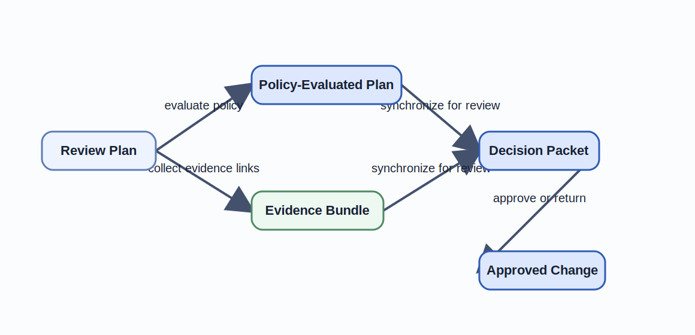
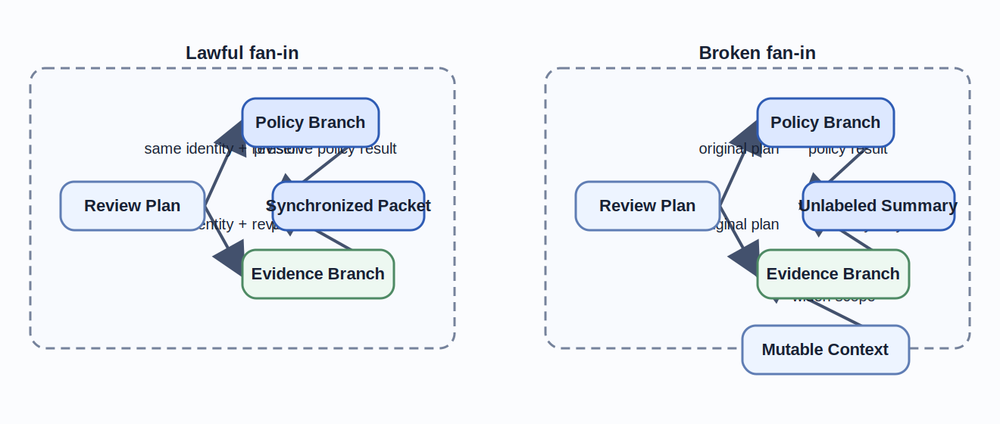

# Monoidal Categories and String Diagrams

Integration discipline is not enough once several governed branches run at the same time.
Parallelism looks attractive because it promises speed without obvious design cost.
This chapter argues that the real question is not how many branches a workflow can run, but whether those branches can return to one lawful approval story without hidden reconstruction.

## Learning goals

- Distinguish ordered workflow obligations from safely parallelizable preparation work.
- Read monoidal composition as a design claim about shared context and explicit fan-in, not only as runtime concurrency.
- Use a string-diagram-style reading to expose hidden coupling and brittle synchronization boundaries.

## Prerequisites

- The integration and shared-boundary discipline from [Chapter 07](../chapter-chapter07/).
- Familiarity with the [orchestration diagram](../../examples/common/policy-gated-change-review/implementation/orchestration-diagram/) and [synchronization boundary](../../examples/common/policy-gated-change-review/implementation/synchronization-boundary/).

## Key concepts

- `monoidal category`
- `string diagram`
- `orchestration`
- `synchronization boundary`

## Running example linkage

- The [orchestration diagram](../../examples/common/policy-gated-change-review/implementation/orchestration-diagram/) is the canonical source behind Figure 8.1.
- The synchronization and workflow artifacts remain available for deeper inspection after the local figure and table have established the fan-out and fan-in argument.

## Sequential and parallel composition

Sequential and parallel composition are design claims before they are scheduling choices.
They answer which obligations must happen in order, which work can proceed independently, and where the workflow is allowed to join the results again.

### Time, order, and concurrency in workflows

Ordered work exists when one step creates the precondition that the next step needs.
In the running example, `Change Request`, `Review Plan`, `Decision Packet`, `Approved Change`, and `Executable Change Set` form that mandatory spine.
The repository should never ask a reviewer to approve a half-formed packet, and it should never dispatch execution before `Approved Change` exists.

That is why sequential composition is not merely about runtime order.
It is about preserving the governance meaning of each boundary.
The step that drafts a bounded plan must happen before the step that evaluates policy because the policy engine needs a fixed scope.
The step that synchronizes review evidence must happen before human approval because the reviewer should not infer missing evidence from branch-local logs.

Parallel work begins only after one artifact boundary is stable enough to be shared.
In the running example, policy evaluation and evidence collection branch from the same `Review Plan`.
Those branches can finish at different wall-clock times without changing the meaning of approval.
They still owe the workflow one named fan-in before review may continue.

### When independence can be exploited

Independence is earned, not assumed.
Two branches are truly independent only when neither branch can silently rewrite the obligation that the other branch is supposed to preserve.
If a branch changes policy vocabulary, scope, or route labels behind the other's back, the workflow is no longer parallel composition in the design sense.
It is hidden shared state with extra latency.

The running example therefore insists on one `Plan Revision` and one `Change Identity` across the fan-out.
Policy evaluation can classify risk while evidence collection gathers links because both branches consume the same revision and neither branch can create `Approved Change`.
That is the practical reading of tensor-like composition in this chapter.
Branches may proceed side by side, but they do not gain authority by racing to the end.

Figure 8.1 makes that governed fan-out explicit before the chapter turns to the string-diagram reading.

Figure 8.1. Running example fan-out and synchronization boundary.
> **Reader takeaway.** Parallel work is acceptable only when one explicit fan-in restores a single review packet before authority can advance.



This is also where teams often over-parallelize.
If a faster path can substitute for a slower path without a named rule, the design has confused throughput with correctness.
The right question is not "Can this run concurrently?"
The right question is "What invariant lets these branches be rejoined without changing the approval meaning?"

Table 8.1. Branch responsibilities at the synchronization boundary.

| Branch or boundary | Primary job | Failure if underspecified |
| --- | --- | --- |
| `evaluate-policy` | Preserve route and policy semantics for the current plan revision. | Review proceeds on stale or ambiguous policy meaning. |
| `collect-evidence-links` | Preserve the evidence set required for human judgment. | The packet reaches review without inspectable support. |
| `synchronize-for-review` | Rejoin branch outputs under one change identity and one revision. | Parallel work produces fragments instead of one governed decision packet. |
| `approve-or-return` | Convert one synchronized packet into a governed decision. | Preparation work silently becomes authorization. |

## Monoidal structure in systems and teams

Monoidal structure gives software teams a disciplined way to talk about side-by-side work that still belongs to one governed workflow.
It says the system needs both sequential composition and a parallel composition operator, plus a neutral context that does not add new obligations by itself.

### Parallelizable work and shared resources

The running example has a small but concrete monoidal structure.
One branch evaluates policy and route obligations.
Another branch gathers evidence links and diff summaries.
The two outputs may be considered together because the workflow preserves the same `Change Identity`, `Repository Scope`, and `Plan Revision` throughout the branch.

The neutral element in this chapter is not an abstract symbol floating above the repository.
It is the case in which no extra branch adds information beyond the existing plan boundary.
If a low-risk change needs no additional evidence collector, the workflow still keeps the same approval contract.
The neutral branch contributes no new artifact, but it does not change the meaning of the composed path.
The engineering reading of the unit law `X ⊗ I ≅ X` is that optional work is safe only when the omitted branch contributes no new synchronization field, no new route label, and no new evidence obligation.
A supposed no-op branch that emits a timestamp, cache marker, or route hint is not the unit.
It has changed the meaning of the composed packet and should be reviewed as a real branch rather than as harmless parallelism.

Shared resources keep this from becoming a naive parallelism story.
Both branches depend on repository metadata, canonical policy labels, and finite reviewer attention.
If those shared resources drift, the workflow may still execute concurrently while failing compositionally.
That is why Chapter 08 treats shared context as part of the structure rather than as invisible infrastructure.

### Coordination costs and synchronization points

Parallel composition pays for itself only when the fan-in is explicit and cheap enough to reason about.
The synchronization boundary is where that cost becomes visible in the running example.
The boundary requires one `Change Identity`, one `Plan Revision`, one policy classification, one evidence set, and one route identifier before the `Decision Packet` may exist.

This boundary is the operational form of the product-like `Combined Review Context` from Chapter 06.
It explains why faster branches do not automatically improve the whole workflow.
If the evidence branch is late or inconsistent, a completed policy result does not move the reviewer any closer to a safe approval.
The coordination cost lives in the named join, not in abstract scheduler overhead.

Teams feel the same cost socially.
Security review, repository review, and implementation review may proceed in parallel for a while.
They still need one synchronization point where the decision can be understood as one governed outcome instead of three partial opinions.
Monoidal language helps because it treats that join as design structure, not as meeting etiquette.

## String diagrams as reasoning tools

String diagrams are useful because they show composition without drowning the reader in incidental syntax.
Wires stand for preserved context or artifacts.
Boxes stand for transformations.
Fan-out and fan-in become visible as first-class design choices rather than as prose buried in a workflow paragraph.

### Reading flows of data, control, and responsibility

In Chapter 08, a wire can carry more than data.
It can carry control authority, review obligations, and invariant preservation.
The wire from `Review Plan` into both parallel branches says that each branch inherits the same scope and revision.
The wire into `Decision Packet` says the reviewer receives a synchronized artifact, not a collection of unrelated logs.

This is why string diagrams are stronger than generic flowcharts for AI-assisted engineering.
The diagram can distinguish a tool call from an approval boundary.
It can show which branch is allowed to emit evidence and which branch is allowed to change authority.
When those wires are missing, the repository has lost a design argument even if the runtime still happens to work.

The governed fan-out therefore serves one concrete review purpose.
It shows that only the `approve-or-return` morphism can create `Approved Change`.
Every earlier branch may prepare information.
None of them may silently turn preparation into authorization.

**Formal bridge.**

The published Mermaid figure is a reader-facing approximation of the string-diagram reading below.

```text
approve-or-return ◦ synchronize-for-review
◦ (evaluate-policy ⊗ collect-evidence-links)
: Review Plan -> Approved Change
```

```text
Review Plan
  |\
  | \ collect-evidence-links ----> Evidence Bundle ----\
  |                                                     > synchronize-for-review -> Decision Packet -> approve-or-return -> Approved Change
  \--- evaluate-policy -----------> Policy-Evaluated Plan --/
```

The tensor-like operator `⊗` marks the point where two branches may proceed in parallel while preserving the same `Review Plan`, `Change Identity`, and `Plan Revision`.
The synchronization morphism is what turns those parallel results back into one governed packet instead of two unrelated outputs.

Figure 8.2 isolates the pedagogical move that Figure 8.1 compresses.
It contrasts one lawful fan-in with one broken one.

Figure 8.2. String-diagram reading distinguishes lawful fan-in from broken summary merges.
> **Reader takeaway.** The fan-in is valid only when both branches preserve the same identity and revision all the way into one named synchronization point.



### Exposing hidden coupling in workflows

String diagrams expose hidden coupling by forcing the author to draw every preserved dependency.
If two branches both read unnamed mutable prompt context, the diagram should include that wire.
If a retry path can rewrite scope after policy evaluation, the diagram should add a new revision wire instead of pretending the original branch is still valid.

This matters because hidden coupling is where concurrent workflows usually become brittle.
A prose description can hide a dependency inside a verb such as "summarize" or "prepare."
A string diagram has less room to cheat.
Once the missing wire is drawn, the team can see that the claimed independence was false or that the synchronization boundary was underspecified.
A lawful fan-in sends the same `Change Identity` and `Plan Revision` through both branches and defines `synchronize-for-review` only when those wires still match.
A broken fan-in lets the evidence branch reread mutable prompt context or widened scope after fan-out and then merge through an unlabeled summary step.
Generic workflow prose can hide that defect because the summary still sounds plausible.
The string-diagram reading cannot.
The merge no longer has one well-defined pair of inputs, so the claimed synchronization point has no trustworthy approval meaning.

The chapter's design lesson is simple.
Whenever a workflow claims to be parallel, ask which wires make that claim true.
If the answer depends on implicit caches, unnamed summaries, or ad hoc reviewer reconstruction, the workflow is not cleanly compositional.

## Coordination patterns and failure isolation

Coordination patterns matter because parallelism changes failure semantics as much as it changes throughput.
The right orchestration design isolates failures at named boundaries instead of letting one branch contaminate the meaning of another.

### Pipelines, fan-out, and fan-in

The running example combines one pipeline with one explicit fan-out and one explicit fan-in.
The pipeline spine preserves review authority.
The fan-out lets the repository evaluate policy and collect evidence without serializing the whole workflow.
The fan-in reconstructs one `Decision Packet` before human judgment begins.

This pattern is reusable because it keeps each shape honest.
The pipeline does not pretend to be parallel where obligations are ordered.
The branches do not pretend to be authoritative where they are only preparatory.
The fan-in does not pretend to be automatic where policy, evidence, and route labels still need to agree.

It is also extensible in a controlled way.
If the repository later adds a security-scan branch or a provenance branch, the new branch must either join at the same synchronization boundary or create a new named one.
That rule is more valuable than any specific queueing technology.
It prevents hidden coordination from leaking into reviewer burden.

### Recovery boundaries and fallback paths

Failure isolation starts by naming which state can be retried and which state must be recomputed from scratch.
If the policy engine fails, the repository should emit a named failure or manual-review route.
It must not create an implicit pass just because the evidence branch succeeded.
If evidence collection fails, the workflow should block synchronization rather than inventing a reviewer packet from incomplete material.

The [synchronization boundary](../../examples/common/policy-gated-change-review/implementation/synchronization-boundary/) keeps these fallback paths honest.
It says partial branch success is not enough to construct later artifacts.
That makes recovery cheaper to reason about because operators know which outputs remain valid and which ones became stale.
When a new `Plan Revision` appears, the old branch outputs are explicitly invalidated instead of lingering as ambiguous cache.

This is also why Chapter 08 cares about failure paths in the diagram itself.
Fallback edges are not decorative.
They change the composition law of the workflow because they define where control returns and which evidence survives.
Ignoring them produces workflows that look elegant on the happy path while collapsing under routine retries.

## Review heuristics for composed workflows

Composed workflows need review heuristics because concurrency can hide design defects behind operational detail.
The goal is not to inspect every worker queue or thread pool.
The goal is to inspect whether the composition preserves one coherent review story.

### What to inspect in orchestration diagrams

- Which artifact boundary authorizes the fan-out.
- Which branch outputs are allowed to exist before human review.
- Which fields make up the synchronization boundary.
- Which morphism alone can create `Approved Change`.
- Which fallback paths preserve evidence and which ones require rework.

These checks are intentionally structural.
They can be applied before the implementation is fully automated.
They also scale better than line-by-line orchestration review because they focus on the invariants that make concurrency safe.

### How to detect brittle coordination designs

Brittle designs usually show one of five signs.
They hide shared mutable context behind supposedly independent branches.
They merge outputs through an unlabeled summary step.
They let execution proceed from a branch-local success instead of a synchronized packet.
They route fallback through an opaque status that loses policy meaning.
They mutate scope or route labels without creating a new revision boundary.

When those signs appear, the design problem is not simply "add more locks" or "serialize the queue."
The workflow is missing a compositional interface.
Chapter 09 keeps the same branches in view, but asks the harder operational question: what happens once those branches start calling tools, writing state, and crossing irreversible boundaries.

## Summary

- Sequential and parallel composition are safe only when the workflow makes authority, shared context, synchronization boundaries, and authoritative state creation explicit.
- The most important brittle signs are `hidden shared mutable context`, an `unlabeled summary step`, `branch-local success`, an `opaque fallback`, and `revision boundary mutation`.
- Monoidal reasoning is useful only when the same `Change Identity` and `Plan Revision` survive to the synchronization boundary instead of being reconstructed after the fact.

## Review prompts

1. Which branches in your current orchestration genuinely share one `Change Identity` and `Plan Revision`, and where is that packet being recreated instead of propagated.
2. Which fan-in step in your workflow is really an unlabeled summary step or an opaque fallback, and what explicit artifact should replace it.
3. Which morphism alone should be allowed to create the next authoritative state, and which branch-local success should stop short of that boundary.

## Notes and Further Reading

- Fong and Spivak are the most relevant mathematical follow-up here because they keep string-diagram reasoning tied to compositional systems and diagrams that engineers can actually reread during design review.
- ReAct is a useful contrast case because it shows how reasoning-and-acting loops become risky when shared mutable context and coordination boundaries stay implicit.
- Bass, Clements, and Kazman complement this chapter by supplying architectural language for failure isolation, shared resources, and the cost of choosing the wrong synchronization boundary.
