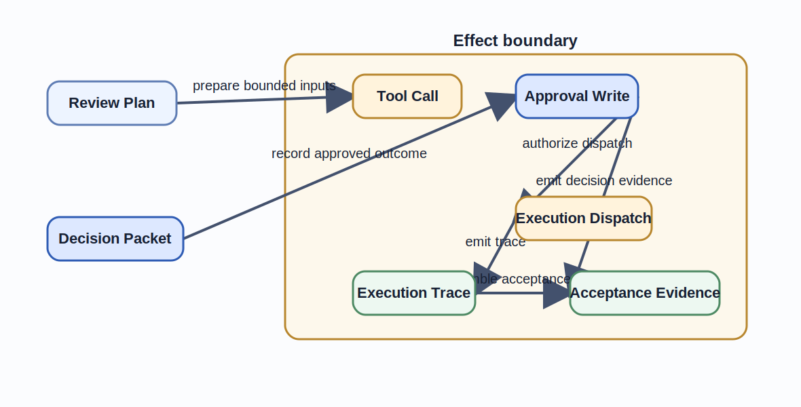
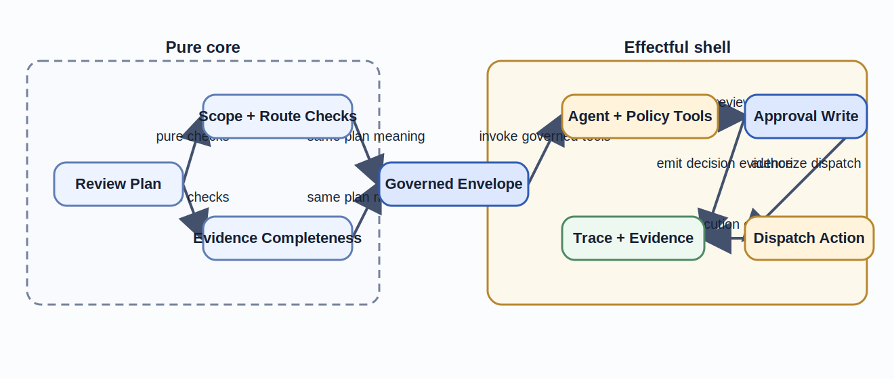

# Monads, Kleisli Composition, and Effect Boundaries

Chapter 08 made coordination visible.
The most expensive workflow defects often begin after the diagram has already stopped helping.
A tool call writes state, an override bypasses a gate, or a dispatch step runs before the repository can explain why it was allowed.
This chapter makes those effects explicit so AI-assisted orchestration remains safe, reviewable, and testable.
Figure 9.1 and Table 9.1 restate the first-reading version of that effect story locally before the reader returns to the canonical repository artifacts.

## Learning goals

- Distinguish pure artifact reasoning from effectful operational steps that change authority or external state.
- Read monads and Kleisli composition as workflow envelopes that preserve evidence and next-step obligations across tool calls.
- Review effect boundaries, retries, and escape hatches without losing the governed approval story.

## Prerequisites

- The orchestration and synchronization patterns from [Chapter 08](../chapter-chapter08/).
- Familiarity with the [effect boundary](../../examples/common/policy-gated-change-review/implementation/effect-boundary/), [execution trace](../../examples/common/policy-gated-change-review/implementation/execution-trace/), and [acceptance evidence](../../examples/common/policy-gated-change-review/verification/acceptance-evidence/) artifacts.

## Key concepts

- `monad`
- `Kleisli composition`
- `effect boundary`
- `execution trace`

## Running example linkage

- The [effect boundary](../../examples/common/policy-gated-change-review/implementation/effect-boundary/), [execution trace](../../examples/common/policy-gated-change-review/implementation/execution-trace/), and [acceptance evidence](../../examples/common/policy-gated-change-review/verification/acceptance-evidence/) are the canonical sources behind Figure 9.1, Figure 9.2, and Table 9.1.
- Chapter 08's [orchestration diagram](../../examples/common/policy-gated-change-review/implementation/orchestration-diagram/) remains the upstream coordination context, but the local figure and table below are sufficient for first reading.

## Why effects need explicit boundaries

Effects matter because the workflow does not live only in design diagrams.
It reads repository state, calls tools, prompts models, writes review decisions, and dispatches execution.
Once those operations touch external state, the repository needs a boundary that says where pure reasoning ends and governed operational behavior begins.

### Side effects as design commitments

In an AI-assisted engineering workflow, a tool call is not a private implementation detail.
It can change which policy route is chosen, which evidence is visible to the reviewer, and which execution target receives the change.
That makes every side effect part of the design commitment.

The effect model captures this by naming the effect class, the dependency, and the emitted evidence for each step.
`draft-plan-with-agent` depends on prompt context and model invocation.
`evaluate-policy` depends on repository metadata and the policy engine.
`record-review-decision` depends on human judgment and audit writes.

This naming discipline matters because it prevents the workflow from collapsing into one vague box called "process change."
When side effects are explicit, reviewers can ask who is authorized to trigger them, what evidence they emit, and what must be true before they run.
When side effects remain implicit, those same questions get answered by runtime accident.

### The cost of hidden operational behavior

Hidden effects damage both correctness and reviewability.
If the prompt context changes without being recorded, the same `Review Plan` may produce a different route decision on a later run.
If a policy tool silently falls back to cached output, the repository may accept a stale classification while believing it observed current state.
If execution dispatch happens before the trace is anchored to `Approved Change`, rollback becomes guesswork.

The cost is not only debugging complexity.
It is the loss of a truthful design model.
A workflow cannot claim to be auditable if the important operational behavior lives outside the artifact set.
This is why Chapter 09 treats effect visibility as a first-class design requirement rather than as an observability enhancement.

## Monads as operational envelopes

A monad is useful in this book because it gives a disciplined way to say that one computation returns both a value and the operational context needed to continue safely.
The point is not to force readers into a specific language runtime.
The point is to keep effects attached to their obligations instead of unpacking them into ambient global state.

### Pure core and effectful shell

The running example keeps a small pure core.
Scope comparison, route-rule comparison, and evidence-completeness checks can be reasoned about as transformations over explicit artifacts.
Those steps are still important, but they are easier to test and review because they do not depend on external systems.

The effectful shell begins where the repository reaches outside that pure core.
Prompting an agent, reading repository metadata, querying a policy engine, recording human approval, and dispatching execution are all effectful steps.
Each one changes what later steps are allowed to believe.
That is why the effect boundary keeps the pure core small and names the shell explicitly.

Figure 9.1 shows the governed effect chain that the trace and acceptance artifacts must later justify.

Figure 9.1. Governed effect chain for the running example.
> **Reader takeaway.** Effectful steps stay governable only when reviewed context, authority, and evidence survive each tool-mediated move.



This separation has an immediate engineering benefit.
If the pure core says evidence is incomplete, the repository can reject the packet without needing to replay external effects.
If the effectful shell fails, the team knows which external dependency or irreversible step was involved.
The design becomes easier to test because not every correctness question requires live tool execution.

Table 9.1. Dominant effect classes in the running example.

| Effectful step | Effect class | Required emitted evidence |
| --- | --- | --- |
| `draft-plan-with-agent` | Prompt and model invocation | Plan revision identity, prompt context reference, generated plan output |
| `evaluate-policy` | Repository read plus policy engine evaluation | Policy classification, policy source, evaluation timestamp |
| `record-review-decision` | Human decision plus durable write | Approval decision record, route, reviewer identity |
| `dispatch-execution` | External state change | Execution trace entry, dispatch target, resulting operational status |

Figure 9.2 separates the chapter's pure reasoning core from the effectful shell that emits durable evidence.
This is the visual distinction the later unit, bind, and Kleisli discussion depends on.

Figure 9.2. Pure checks stay inside the core while governed effects remain in the shell.
> **Reader takeaway.** The envelope is useful only when pure checks stay stable and every effectful step emits reviewable evidence at the shell boundary.



### Transfer case: customer-support escalation workflow

The same effect discipline appears in customer-support escalation.
An AI assistant may classify or summarize the case, but customer-visible state change still crosses a named effect boundary that must emit evidence.

| Running-example role | Customer-support escalation workflow |
| --- | --- |
| Core objects | `Support Request`, `Escalation Packet`, `Approved Escalation`, `Action Record` |
| Core morphisms | `classify-request`, `draft-escalation-packet`, `approve-escalation`, `dispatch-action` |
| Core diagram claim | The escalation route is acceptable only if case identity, severity meaning, and selected action remain aligned across triage and approval. |
| Effect boundary | Customer communication, ticket-state mutation, external paging, incident-channel writes |
| Approval and evidence model | Approval is the operator-approved escalation packet, while evidence includes transcript excerpts, severity rules, routing notes, and action timestamps. |

Appendix D expands the full mapping.
For this chapter, the essential lesson is simpler.
Even outside software delivery, effectful dispatch is governed only when the emitted evidence stays attached to the same approved packet.

### Reading unit and bind in engineering terms

The unit operation is the move that places a pure artifact into the governed workflow without adding new side effects.
In practice, that means taking a completed artifact such as `Review Plan` and treating it as the current value inside the review envelope.
The repository has not yet changed external state merely by acknowledging that artifact.

Bind is the step that consumes the governed context and produces the next governed context.
If `evaluate-policy` fails, the bind result is not a naked absence of value.
It is a governed state that still carries trace obligations, route meaning, and a next action such as retry, manual review, or return-for-rework.
This is the practical reason monadic language helps here.
It forces the workflow to preserve context across effectful chaining instead of dropping it between tool calls.

In the running example, every successful bind keeps the same `Change Identity` and current `Plan Revision`.
Every failing bind yields an outcome the rest of the workflow can still review.
That is more valuable than the abstract term itself because it turns effect handling into a visible repository contract.

## Kleisli composition for agent orchestration

Kleisli composition matters when the output of one effectful step already lives inside the workflow's operational envelope.
The next step must accept that envelope and return another one.
That is exactly what happens in AI-assisted orchestration.

### Tool calls, prompts, and execution context

The running example uses at least four effect sources.
The agent runtime uses prompt context to draft or revise the plan.
The policy engine reads repository state and emits a policy evaluation record.
The reviewer writes an approval decision.
The executor changes external state by dispatching implementation work.

Treating those steps as ordinary function composition would hide too much.
The workflow must know which prompt context was used, which tool version produced the result, and which actor changed authority.
Kleisli composition is the book's way of saying that effectful steps compose only if they preserve the governed context that later review depends on.

This is why the [execution trace](../../examples/common/policy-gated-change-review/implementation/execution-trace/) is not a debugging afterthought.
It is the concrete record of how Kleisli-style chaining happened in the repository.
Each step carries the artifact boundary, the effect class, the actor or tool, and the evidence link that justifies continuing.

**Formal bridge.**

```text
Effectful chain:
draft-plan-with-agent : Review Plan -> M Reviewed Plan Revision
evaluate-policy : Reviewed Plan Revision -> M Policy-Evaluated Plan
record-review-decision : Policy-Evaluated Plan -> M Approved Change
dispatch-execution : Approved Change -> M Executable Change Set

Combined path:
Review Plan -> M Executable Change Set
```

Here `M` is the governed effect envelope that carries trace obligations, authority changes, and permitted next actions together with the value.
The chain is safe only when each step returns another governed state instead of dropping context between tool calls.

### Chaining effectful steps safely

Safe chaining means each step consumes explicit input and returns explicit output plus operational obligations.
The policy branch does not merely say "policy passed."
It returns `Policy-Evaluated Plan` together with a recorded classification.
The evidence branch does not merely say "links collected."
It returns an `Evidence Bundle` that the synchronization boundary can inspect.

This makes fallback behavior compositional.
If policy evaluation times out, the workflow does not jump directly to approval.
It returns a governed state that can be retried or escalated.
If evidence collection fails, the failure is carried into the synchronization point instead of being silently ignored.

The important engineering consequence is that later steps never have to guess whether an earlier effect already happened.
They can inspect the envelope, the trace, and the emitted evidence.
That is the operational form of safe Kleisli composition in this book.

## Managing error, state, I/O, and external tools

Real workflows combine multiple effect classes.
The challenge is not to eliminate that mix.
The challenge is to choose one dominant design envelope so the repository has a stable place to record them.

### Choosing the dominant effect model

The running example chooses governed review state as the dominant envelope.
Every important step is evaluated by asking what it means for review, approval, traceability, and execution rights.
That choice is more practical than choosing a generic error-only or state-only model because the repository's main risk is unauthorized or unreviewable change.

Error still matters because tool calls can fail.
State still matters because plan revisions and route labels can change.
I/O still matters because the workflow reads repository metadata and writes execution results.
But those concerns are interpreted through one dominant question: can the step still support a truthful review and approval story.

This is why the effect boundary names human approval as effectful.
Approval changes authority, which is the workflow's most important state transition.
If the envelope fails to model that transition, it has already chosen the wrong dominant effect model for this system.

### Composing multiple effects without confusion

Teams often lose clarity by stacking unnamed effects on top of each other.
A prompt changes the plan.
A tool call changes the policy result.
A cache changes the latency story.
A reviewer decision changes authority.
An execution tool changes repository state.
If each layer carries its own local conventions, the workflow becomes unreadable.

The running example solves this by keeping one reader-facing envelope and surfacing the rest as named fields or evidence within that envelope.
Prompt context, tool outputs, approval writes, and dispatch results all appear in the trace and acceptance evidence.
The repository does not need separate public formalisms for each internal helper library.
It needs one stable operational story.

That strategy also reduces confusion during review.
The reviewer asks one question at each boundary.
What happened, under which authority, with which evidence, and what is the next permitted step.
If the system can answer that consistently, mixed effects remain manageable.

## Effect containment in production systems

Containment matters because some effects are reversible, some are replayable, and some change the world in ways that require human explanation.
Production safety depends on keeping those distinctions explicit.

### Reviewable escape hatches

Every production workflow eventually needs an escape hatch.
A policy engine may be unavailable.
A tool may produce malformed output.
A reviewer may need to force manual handling.
The mistake is not having the escape hatch.
The mistake is letting it operate as an invisible default.

In the running example, escape hatches cross the effect boundary and therefore must be reviewable.
Manual override, cached policy usage, or forced return-for-rework must each emit trace evidence and record who authorized the deviation.
Otherwise the workflow teaches operators to trust outcomes that no artifact can justify later.

This is also why Chapter 09 keeps escape hatches close to approval semantics.
An escape hatch that changes authority or bypasses required evidence is not a convenience feature.
It is a governance event.

### Operational limits, rollback, and audit

Containment also requires explicit operational limits.
Retries should stop at the branch or synchronization point that failed.
Rollback should target the last safe boundary rather than replay the whole pipeline blindly.
Execution dispatch should happen only after the workflow can attach it to `Approved Change` and to the current trace context.

Acceptance evidence closes this loop.
It says which records must survive even when the workflow returns for rework.
The execution trace records what actually happened.
Together they keep rollback and audit attached to the same governed story instead of splitting them across logs that readers cannot reconcile.

With those boundaries in place, Chapter 10 can stop teaching the pieces separately.
It treats specification, design, review, orchestration, and effect evidence as one continuous delivery argument.

## Summary

- Effect boundaries matter because tool calls, approval writes, and execution dispatch change what later steps may safely assume.
- Monadic and Kleisli language is useful when it keeps value, evidence, and authority inside one explicit operational envelope.
- Escape hatches, retries, rollback, and audit remain trustworthy only when they emit reviewable evidence at named boundaries.

## Review prompts

1. Which step in your current workflow changes authority or external state without a visible effect boundary.
2. Which effectful chain in your repository still drops context between tool calls or retries.
3. Which escape hatch in your system should be treated as a governance event rather than as an operational convenience.

## Notes and Further Reading

- Mac Lane and Awodey provide the formal background for monads and compositional effect handling, but this chapter deliberately uses them to reason about governed operational envelopes.
- NIST AI RMF and the SSDF community profile for generative AI are the best practical companions when you need a control vocabulary for effectful tool use, retries, and human checkpoints.
- ReAct is again a useful comparison because it shows the performance appeal of tool-mediated reasoning while leaving this chapter's stronger effect boundary discipline to the reader.
