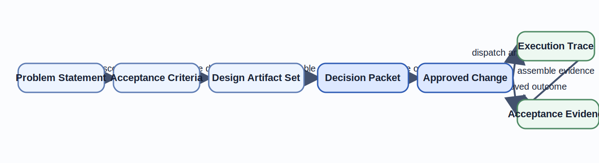

# Case Study: From Specification to AI-Assisted Implementation

After nine chapters of local concepts, the method has to survive one continuous delivery story.
This chapter is where the book has to earn its claims as one governed packet from request to evidence.
The risk at this stage is not missing terminology.
It is that the earlier vocabulary still reads like separate local tools instead of one delivery argument a reader could actually apply.
This chapter therefore reconstructs that full argument locally as one case-study packet.

## Learning goals

- Reconstruct the full governed delivery path from specification to AI-assisted implementation.
- Identify where each chapter's formal vocabulary becomes a concrete artifact, review gate, or verification consequence.
- Evaluate whether the running example remains auditable, reviewable, and extensible as one composed workflow.

## Prerequisites

- The earlier chapters, especially [Chapter 01](../chapter-chapter01/), [Chapter 03](../chapter-chapter03/), [Chapter 08](../chapter-chapter08/), and [Chapter 09](../chapter-chapter09/).
- Familiarity with the canonical running example artifact set.

## Key concepts

- `Decision Packet`
- `execution trace`
- `acceptance evidence`
- `traceability matrix`

## Running example linkage

- The [running example](../../examples/common/policy-gated-change-review/README/) remains the canonical repository source for the case study.
- For a first reading, Table 10.1 and Figure 10.1 restate the minimum end-to-end packet locally.
- Use the design and evidence artifacts later when you want file-level audit detail beyond the chapter's case-study path.

## Framing the case study

The case study matters because the earlier chapters were not meant to stay as isolated formal tools.
They were meant to produce a workflow that a repository can actually use to govern AI-assisted change.
Chapter 10 reconstructs that workflow end-to-end and shows which artifacts carry each design commitment.

### Problem statement and system boundary

The case study begins with one bounded request and one explicit system boundary.
The problem is intentionally narrow.
The repository must process change requests that may be partially prepared by an AI agent while remaining auditable, reviewable, and reversible.
The workflow now extends through execution or return-for-rework rather than stopping at a pre-execution approval placeholder.

That bounded scope is a feature, not a limitation.
It keeps the design argument honest.
The book is not trying to solve autonomous release management, arbitrary multi-repository orchestration, or a generic agent platform.
It is solving one high-value engineering problem: how to move an AI-assisted change through design, review, approval, execution, and evidence without losing control of meaning.

The system boundary also gives the reader a test for later chapters.
Every artifact should help explain how a change stays inside that boundary.
If a step cannot be linked back to the problem statement, it is likely operational noise or hidden policy.

### Success criteria and non-goals

The acceptance criteria define success in artifact terms.
The workflow must expose `Change Request`, `Review Plan`, `Decision Packet`, `Approved Change`, and acceptance evidence as explicit artifacts.
It must keep policy evaluation, evidence collection, and human approval separate even when some work runs in parallel.
It must preserve a reviewable synchronization boundary and an execution trace that remains linked to one change identity and one plan revision.

The non-goals are equally important.
The case study does not permit autonomous approval.
It does not permit opaque tool chaining.
It does not try to model every deployment system surrounding the repository.
Those exclusions protect the example from becoming so broad that no compositional claim can be checked.

Success therefore means more than "the patch landed."
It means the repository can reconstruct why the patch was allowed, which artifacts justified it, and which effects occurred along the way.
That is the practical promise of the book's method.

## Building the artifact set

The artifact set is the backbone of the case study.
Without it, later review would depend on memory or log archaeology.
With it, each chapter's formal vocabulary becomes a concrete repository interface.

### Specification, architecture, and interface contracts

The first layer is specification.
The problem statement fixes scope, constraints, and non-goals.
The acceptance criteria fix what counts as a successful governed outcome.
These files prevent later implementation details from redefining the problem after work has already begun.

The second layer is design.
One artifact map names the canonical files.
One commutative diagram states the preserved approval meaning.
One variation structure separates combined review context from alternate review routes.
One shared-boundary and replacement plan define how the example handles integration and migration pressure without rewriting its core approval semantics.

Together these artifacts act as interface contracts for the rest of the repository.
They say which objects exist, which labels remain canonical, and which transformations are allowed to preserve meaning.
That is why Chapter 10 treats them as live engineering assets rather than as teaching aids.

### Diagram set and traceability matrix

The diagram set makes different kinds of structure visible.
The commutative diagram expresses equivalence of review meaning across paths.
The runtime view and reviewer view translate that meaning into operational and human decision contexts.
The orchestration diagram and synchronization boundary express sequential and parallel composition at the implementation layer.
The effect boundary explains where external state and authority changes enter the system.

The traceability matrix ties these pieces together.
It records which claims about approval, synchronization, effect visibility, and evidence can be traced from specification to implementation.
That matrix is deliberately lightweight.
Its value comes from linking stable artifacts, not from replacing them with one master spreadsheet.

Table 10.1. Artifact packet by delivery phase.

| Delivery phase | Canonical artifact | Why the phase matters |
| --- | --- | --- |
| Specification | `problem-statement.md`, `acceptance-criteria.md` | Fixes the scope and non-goals that later automation must not rewrite. |
| Design | `artifact-map.md`, `commutative-diagram.md`, `variation-paths.md` | States the structural claims and stable interfaces that later steps must preserve. |
| Review | `reviewer-view.md`, `Decision Packet`, `review-checks.md` | Makes the human checkpoint explicit before approval. |
| Implementation | `workflow.md`, `orchestration-diagram.md`, `effect-boundary.md` | Defines how governed automation and effectful execution may proceed. |
| Verification and evidence | `traceability-matrix.md`, `execution-trace.md`, `acceptance-evidence.md` | Closes the loop from design claims to operational proof. |

Figure 10.1 compresses the case study into the shortest reader-facing artifact path.

Figure 10.1. End-to-end artifact path for the case study.
> **Reader takeaway.** The delivery argument is complete only when specification, design, review, implementation, and evidence remain one connected path.

This is the chapter's central case-study lesson.
A strong artifact set does not mean more documents for their own sake.
It means each important claim has one stable place to live and a short path to the other places that depend on it.

## Verification and review design

Verification in this case study is not limited to unit tests or runtime assertions.
It is the broader design of how the repository decides that a change remained governed from start to finish.
That design combines checklists, negative examples, traceability, acceptance evidence, and human judgment.

### Test strategy and acceptance evidence

The review checks provide the short checklist.
They confirm that the artifact set is complete, that the human approval gate and synchronization boundary are explicit, and that effectful steps emit trace evidence.
The coherence-failure example provides the negative case.
It reminds reviewers what happens when route or policy meaning drifts across views.

Acceptance evidence is where the case study closes the loop.
Acceptance requires a specification reference, design references, review evidence, `Approved Change`, and execution trace entries that all point to the same governed outcome.
If those references disagree, the repository should treat the change as unaccepted even if individual files or logs look plausible in isolation.

This is stronger than a generic "all checks passed" rule.
It asks whether the checks, evidence, and authority changes can still be reconstructed as one compositional path.
That is the verification consequence of the book's approach.

### Human checkpoints in an AI-assisted loop

Human checkpoints remain necessary because authority cannot be delegated away by better orchestration alone.
The AI agent may draft a bounded plan, collect evidence, or suggest revisions.
It may not approve the change.
The reviewer still has to decide whether the synchronized packet justifies advancing to `Approved Change`.

The case study also shows that there is more than one human checkpoint shape.
Normal approval is one checkpoint.
Manual handling of a failed policy tool is another.
Return-for-rework after incomplete evidence is another.
Each checkpoint must still preserve the same artifact identity and evidence story.

That is why the human loop appears in multiple artifacts rather than in one isolated approval file.
The reviewer view shows what the human sees.
The workflow and orchestration artifacts show when the human is invoked.
The execution trace and acceptance evidence show what remains after the decision is made.

## AI-assisted implementation

The implementation part of the case study shows what happens after the artifact set is in place.
The goal is not to let the agent improvise the process.
The goal is to let bounded automation operate inside a workflow that already knows how to review, synchronize, and verify its own steps.

### Delegating bounded tasks to agents

Bounded delegation begins with the `Review Plan`.
The agent may propose how to classify scope, which checks are required, and which evidence links should be gathered.
That proposal is useful precisely because it stays bounded.
It names the work without claiming authority over approval.

From there, the workflow can parallelize agent-assisted and tool-assisted tasks safely.
The policy branch can query repository policy.
The evidence branch can collect diff summaries or link known checks.
The local orchestration argument shows that both branches still owe the synchronization boundary one coherent packet before human review continues.

This is the chapter's practical answer to a common automation mistake.
Do not delegate "handle the change."
Delegate one bounded transformation with named inputs, outputs, and effect boundaries.
That keeps the agent inside a compositional interface the repository can still audit.

### Reviewing outputs, failures, and rework

Review is where the case study proves whether the earlier formalism was worth the effort.
If the synchronized packet is complete, the reviewer can decide on one artifact with one route and one evidence set.
If policy evaluation failed, if evidence is missing, or if a new plan revision appears, the workflow returns for rework rather than improvising around partial state.

The execution trace makes these branches visible after the fact.
The effect boundary explains why some steps may be retried and others require explicit human action.
The acceptance evidence rules explain which records must survive even when the change is not accepted on the first attempt.

This is what controlled AI-assisted implementation looks like in practice.
The repository does not trust the agent because the agent is intelligent.
It trusts the workflow because the workflow keeps meaning, authority, and evidence attached to the same artifact path.

## Retrospective and extension points

The case study is small, but it is large enough to validate the method's core claims.
It shows that the book's formal vocabulary is useful when it improves artifact quality, review discipline, and operational evidence.

### What the case study validates

The case study validates five concrete claims.
Compositional vocabulary can be attached to repository artifacts without turning the book into a generic mathematics text.
Human and AI responsibility boundaries can stay explicit even when the workflow uses parallel branches and effectful tools.
Diagram reasoning can survive translation across design, runtime, review, and implementation views.
Effect boundaries can make prompts, tool calls, approval writes, and dispatch steps auditable.
Acceptance can be justified by a small evidence bundle rather than by institutional memory.

Just as important, the example remains small enough to inspect manually.
That matters because compositional design should sharpen engineering judgment before it becomes automation.
If the example required a large platform before the reader could test the method, the method would be much weaker.
The transfer cases threaded through the late body chapters make the same point inside the body rather than only in an appendix.
Appendix D extends that claim by mapping the same backbone into deployment approval, customer-support escalation, and regulated change-management workflows.
What remains invariant across those domains is the same bounded request, reviewable plan, synchronized packet, governed decision outcome, and post-approval evidence model.

### Transfer case: deployment approval pipeline

The same end-to-end packet appears in deployment approval work.
Release automation may prepare a rollout path, but the delivery argument still depends on one bounded request, one governed decision, and one evidence trail that survives execution.

| Running-example role | Deployment approval pipeline |
| --- | --- |
| Core objects | `Deployment Request`, `Release Plan`, `Approved Release`, `Execution Window` |
| Core morphisms | `derive-release-plan`, `evaluate-release-policy`, `approve-release`, `dispatch-rollout` |
| Core diagram claim | The release path is valid only if rollout scope, policy evaluation, and human approval preserve the same release revision. |
| Effect boundary | Release write, environment mutation, rollback trigger, external incident notification |
| Approval and evidence model | Approval is the signed `Approved Release`, while evidence includes test reports, policy results, rollout logs, and rollback records. |

Appendix D provides the fuller transfer appendix.
What matters in the body chapter is that the same composed packet can govern repository delivery and release delivery without forking the method into a second narrative.

### Where teams may want stronger tooling

The case study also shows where teams may want stronger tooling support.
The synchronization boundary is still checked by repository discipline and lightweight review artifacts rather than by a dedicated validator.
Claim IDs are traceable, but they are not yet rendered automatically into diagrams or acceptance evidence bundles.
Execution trace collation remains a documented structure rather than a generated report.

Those gaps do not weaken the method the chapter has demonstrated.
They mark the points where teams can add stronger automation once the underlying packet, evidence path, and review boundaries are already stable.
The book's claim is that the method is mature enough to apply now.
Future hardening should preserve the same canonical interfaces rather than replace them.

## Summary

- The case study validates that the book's formal vocabulary becomes useful when it maps cleanly onto repository artifacts, review gates, and evidence obligations.
- The artifact set, traceability matrix, execution trace, and acceptance evidence together make the delivery argument reconstructable after the fact.
- The remaining work is not to replace the method, but to harden selected interfaces and validators while preserving the same governed path.

## Review prompts

1. Which artifact in the case study would fail first if your team tried to skip a design step and rely on execution evidence alone.
2. Which checkpoint in your current delivery process still lacks a clear packet equivalent to the running example's `Decision Packet`.
3. Which validator or automation step would most improve confidence without changing the canonical artifact interfaces.

## Notes and Further Reading

- NIST SSDF and the generative-AI SSDF profile are the strongest practical companions if you want to harden the case study into a fuller delivery control program.
- AI RMF and the Generative AI Profile extend the governance vocabulary around risk, monitoring, and disclosure beyond the repository scope of this case study.
- SWE-bench is relevant here because it pressures AI-assisted repository workflows with issue-driven evaluation rather than with synthetic coding prompts alone.
